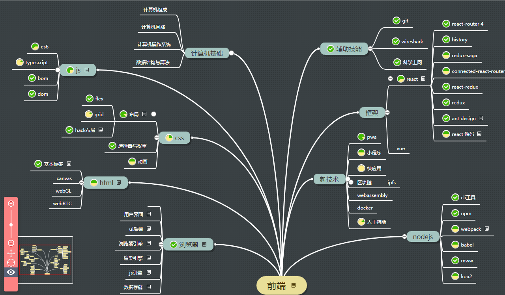

# Blog

个人技术总结，技术发展方向：目标是一名卓越的软件工程师，从前端入手，让前端能力成为我的杀手锏，同时也能解决其他软件工程方面的能力

个人实践，并深入分析之后总结

> 说明：写(复制)这些文章，目的是让自己对js基础知识掌握更全面。这里总结的是自己不是很熟或者陌生的知识点，如果说熟悉了的，平常用到的，就不总结了。  
> 不着急总结全部知识，每个知识追求细枝末节，希望掌握全面  
> 使用技术：学习技术，要结合实际项目来学习，脱离项目的学习很快就会忘记；结合项目的学习，负责任把项目做好，技术做深入，能力自然就提升了。  
> 新技术：关注新技术，先总结其能做什么，再考虑能否在项目中融合使用进去  
> 项目开发目标：首要完成项目，其次 **提升自己技术能力**，正是玉伯的：业务为正，专业为奇。

- html
  - ✔ [深入html-标签语义化](html/深入html-标签语义化.md)
- css
  - ✔ [cssModule](css/cssModule.md)  :global、:local、composes继承
  - ✔ [深入css-flex布局](css/深入css-flex.md)
  - [深入css-grid布局](css/深入css-grid.md)
  - ✔ [深入css-fixed、absolute、float](css/深入css-fixed、absolute、float.md)
  - ✔ [深入css-block、inline、inline-block](css/深入css-block、inline、inline-block.md)
  - ✔ [深入css-选择器及权重](css/深入css-选择器及权重.md)
  - [常见知识归纳](css/常见知识归纳.md) 包含了 css 一些常用知识点：盒子模型、选择器、字体使用、rem等
  - [预处理器-less](css/预处理器-less.md)
  - css 工具-postcss
  - transform 动画
  - animate 动画
  - [动画-flip](css/动画-flip.md) flip技术让过渡动画更流畅
- javascript
  - ✔ [es2015-解构赋值](es/es6-解构赋值.md)
  - ✔ [es2015-decorator](es/es6-decorator.md)
  - ✔ [es2015-模板字符串](es/es6-模板字符串.md)
  - ✔ [es2015-Symbol](es/es6-Symbol.md)
  - ✔ [es2015-promise](es/es6-promise.md)
  - ✔ [es2015-generator](es/es6-generator.md)
  - ✔ [es2015-async](es/es6-async.md)
  - ✔ [深入js-编码规则](es/深入js-编码规则.md)
  - ✔ [深入js-词法作用域](es/深入js-作用域.md)
  - ✔ [深入js-语句与表达式](es/深入js-语句与表达式.md)
  - ✔ [深入js-基本类型](es/深入js-基本类型.md) 包含了数值、函数、对象的关键点总结
  - ✔ [深入js-原型与继承](es/深入js-原型与继承.md)
  - ✔ [深入js-执行上下文](es/深入js-执行上下文.md)
  - ✔ [深入js-闭包](es/深入js-闭包.md)
  - ✔ [深入js-正则表达式](es/深入js-正则表达式.md)
  - ✔ [深入js-内存管理与垃圾回收](es/深入js-内存管理与垃圾回收.md)
  - [深入js-this](es/深入js-this.md)  说明了 this 指向问题
  - [深入js-一些功能模拟实现](es/深入js-一些功能模拟实现.md)
  - [js-奇技淫巧](es/js-奇技淫巧.md)  比如 0.1+0.2 问题、退出循环等问题
- nodejs
  - ✔ [cli工具](nodejs/cli工具.md)
  - ✔ [npm发包](nodejs/npm发包.md)
  - [nodejs 基础](nodejs/基础知识.md) 学习 nodejs 时，要配合 javascript 严格模式学习
  - ✔ [koaAPI](nodejs/koaAPI.md) koa 实现了 http 服务器方面功能，包括 response, request, context 3大api
  - [koa 进阶](nodejs/koa进阶.md) 学习 koa 如何使用
- 浏览器
  - ✔ [深入浏览器-dom](browser/深入浏览器-dom.md)
  - ✔ [深入浏览器-bom](browser/深入浏览器-bom.md)
  - ✔ [深入浏览器-浏览器](browser/深入浏览器-浏览器.md)
  - ✔ [深入浏览器-事件循环](browser/深入浏览器-事件循环.md)
  - [web 存储](PWA/web存储.md)
  - ✔ [跨域实现的几种方法](other/跨域实现的几种方法.md)
  - [浏览器安全](browser/深入浏览器-安全.md) 常见 xss 攻击及防御
  - ✔ [利用无头浏览器实现ui自动化测试](browser/利用无头浏览器实现ui自动化测试.md) 亮点技能 - ui 自动化测试
  - [关于前端监控的几点思考](browser/关于前端监控的几点思考.md)
- 构建工具
  - ✔ [webpack基础](builder/webpack专题.md)
  - [npm基础](builder/npm专题.md)
  - webpack 运行原理
  - webpack loader
  - webpack plugin
  - rollup基础
  - fis基础
  - ✔ [babel plugin](builder/babel.md)
- 框架
  - [mvvm](other/mvvm.md) 都在用 mvvm ，到底什么 mvvm 是什么？
  - [源码解读-antd](react/源码解读-antd.md)
  - react
    - ✔ [源码解读-dva](react/源码解读-dva.md)
    - ✔ [源码解读-redux](react/源码解读-redux.md)
    - ✔ [源码解读-react-redux](react/源码解读-react-redux.md)
    - ✔ [源码解读-react-router](react/源码解读-react-router.md)
    - ✔ [源码解读-history](react/源码解读-history.md)
    - [源码解读-connected-react-router](react/源码解读-connected-react-router.md)
    - ✔ [源码解读-redux-saga](react/源码解读-redux-saga.md)
    - [源码解读-setState](./源码解读-setState.md)
    - ✔ [深入理解virtualDOM](react/深入理解virtualDOM.md)
    - ✔ [基本使用-react](react/基本使用-react.md) 官网 api + 使用技巧
    - ✔ [基本使用-react-router](react/基本使用-react-router.md) ：react-router 4
    - ✔ [vue vs react](react/react-vs-vue.md) : 可以直接参考 vue 及 react 相关知识点
  - vue
    - ✔ [vue router](vue/vue生态-router.md) vue-router, 路由使用，路由配置，路由守卫，静态路由，动态路由
    - ✔ [vuex](vue/vue生态-vuex.md) vue 状态管理
    - ✔ [vue-cli](vue/vue生态-vue-cli.md) vue-cli 插件原理
    - ✔ [vue 组件通信](vue/vue组件通信.md) vue 组件间的 10 种通信方式
    - ✔ [vue 组件复用](vue/vue组件复用.md) vue 组件优化：10 种复用方式
    - [vue 组件抽离规范](vue/vue组件抽离规范.md) vue 组件抽离原则
    - ✔ [vue深入](vue/vue深入.md) vue 整体深入架构入口，介绍了 vue 整体模块
      - ✔ [vue深入 - 响应式系统](vue/vue源码解读/响应式系统.md) vue 响应式系统
      - ✔ [vue深入 - 数据驱动](vue/vue源码解读/数据驱动.md) vue 数据驱动 vnode
      - ✔ [vue深入 - 组件化](vue/vue源码解读/组件化.md) vue 组件化
      - [vue深入 - compiler](vue/vue源码解读/compiler.md) vue compiler 编译原理 ast
    - ✔ [vue vs react](react/react-vs-vue.md) vue 基本知识点
    - ✔ [vue 目录规范](vue/vue目录规范.md) vue 目录规范
  - [校验：eslint](react/基本使用-eslint.md)
  - 测试：mocha, karma, jest, enzyme  需要注意的有：注释规范、命名规范、语法规范、文件组织结构规范、接口文档规范、设计文档规范等
  - 模拟: mock
  - Rxjs: [中文官网](https://cn.rx.js.org/)
- pwa
  - ✔ [webWorkers](PWA/webWorkers.md) 亮点技能 - pwa
  - ✔ [pwa构建](PWA/pwa构建.md) -- [体验](https://heyunjiang.github.io/)
- git
  - ✔ [常见问题及答案](git/常见问题及答案.md)
  - ✔ [git知识点总结](git/git知识点总结.md)
- 软件工程
  - ✔ [项目日常感悟](software/项目开发的日常感悟.md)
  - ✔ [项目中遇到的问题](software/项目中遇到的问题.md)
  - ✔ [项目经验](https://github.com/heyunjiang/Blog/blob/master/react/react-vs-vue.md#5-%E9%A1%B9%E7%9B%AE%E7%BB%8F%E9%AA%8C%E6%80%BB%E7%BB%93)
  - ✔ [MBA](software/MBA.md)
- 设计模式、技巧
  - [高阶组件](designModal/HOC.md)
  - [Observer模式](designModal/从vue响应式数据看观察者模式.md)
  - mediator
  - 工厂
- 规范
  - W3C标准
  - ES规范
- 计算机基础
  - [计算机组成原理](计算机基础/结构-计算机组成原理.md)
  - ✔ [vultr 搭梯子](计算机基础/vultr搭梯子.md)  科学上网，你懂的
  - 操作系统
  - 计算机网络
    - [http 3](计算机基础/网络-http3学习.md)
    - ✔ [http1、http2简介](计算机基础/网络-专题-http.md)
    - ✔ [常见 http 状态码、解释及解决方案](计算机基础/网络-httpCode.md)
    - ✔ [七层协议](计算机网络/网络-七层协议.md)
    - ✔ [网络抓包](计算机网络/网络-抓包.md) wireshark
    - ✔ [nginx 与 反向代理](other/nginx配置介绍.md)
  - 数据结构与算法
    - ✔ [冒泡排序](计算机网络/算法-冒泡排序最优.md)
- 技术方向
  - [webGL](webGL/入门.md): 3D
  - [svg](html/svg入门.md) svg 入门学习
  - canvas: 2D
  - webRTC: 实时通信技术
  - docker基础: 容器技术
  - webAssembly: 提升项目运行效率，能在浏览器中跑的另一种语言
  - flutter: 移动应用开发，替代 android ios
  - typescript: 强类型语言
  - GraphQL: vs restful
- 用户体验
  - [字体优化](用户体验/字体优化.md)
- 人工智能
  - [人工智能入门](人工智能/人工智能入门.md)
  - [python入门](人工智能/python入门.md)
- 示例 demo
  - 智能提示组件: 在 textarea 输入时，基于 react + getBoundingClietRect + element.selectionStart 实现的智能提示

> 注：没有链接的表示待发展、学习的技术

## 沟通

面试、同领导沟通、同下属沟通、同级沟通，都是双方人生价值观、人生规划、技术追求、业务更好实现的碰撞。  
1. 我不会因为你的某一点不合就不招你，相反，如果如果你自身有几个亮点，那么我很愿意跟你共事。
2. 面试时，我们可以尽心去展示自己，不用有顾虑，畅心与面试官聊，如果面试官仅仅因为你的某一些缺点就忽略你其他更大更有价值的有点，那么不去也罢。

## 知识学习方法

现在是学习已有的知识，然后灵活运用它到工作中，还不必去创造新的技术地步

## 运营

目标 + 决策 + 资源配置

目标：清晰明确的目标，知道带来的收益，目标倒推、精细拆解、环环相接  
决策：决定下一刻需要立即做的事情，不做哪些事情  
资源配置：老板给的资源合理利用
