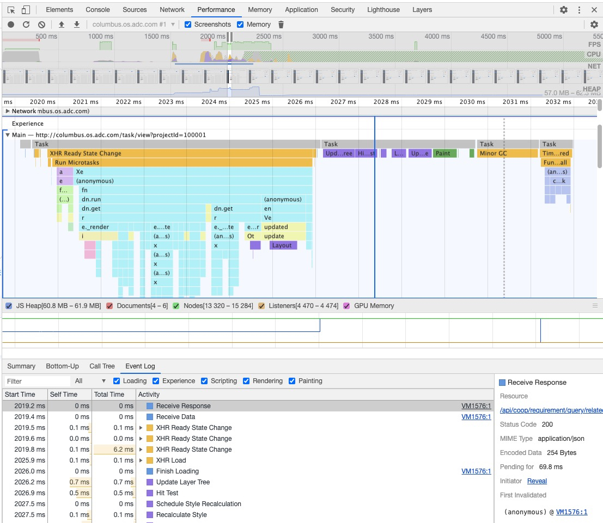

# 深入浏览器-事件循环

time: 2019.01.09

浏览器事件模型与事件循环

目录

[1 浏览器中的事件循环](#1-浏览器中的事件循环)  
&nbsp;&nbsp;[1.1 浏览器事件类型](#1.1-浏览器事件类型)  
&nbsp;&nbsp;[1.2 堆、栈与队列](#1.2-堆、栈与队列)  
&nbsp;&nbsp;[1.3 事件循环过程](#1.3-事件循环过程)  
&nbsp;&nbsp;[1.4 rerendertask](#1.4-rerendertask)  
&nbsp;&nbsp;[1.5 渲染引擎获取不同资源对 js 引擎任务调度的阻塞情况](#1.5-渲染引擎获取不同资源对-js-引擎任务调度的阻塞情况)  
[2 特例处理-十万条数据渲染](#2-特例处理-十万条数据渲染)  

## 1 浏览器中的事件循环

在浏览器主线程中，事件调度如图所示



浏览器的主线程，穿插调用浏览器的各个组件，比如加载 html, css, js 的时候，会交替调用渲染引擎、浏览器引擎、网络引擎。当渲染结束，用户操作，会与浏览器进行交互，触发各种事件，这时也在主线程中进行，主要对这个阶段进行分析

### 1.1 浏览器事件类型

1. macrotask: 普通 script 任务(一段代码，包含独立作用域、执行上下文)、dom event、setTimeout、setInterval、xhr 回调、rerendertask、minor gc 等 gc 任务。渲染进程主线程的执行，就是按一个一个任务宏来调度执行。
2. microtask: promise、MutationObserver、process.nextTick。每个宏任务下面对应一个微任务队列，在当前宏任务执行完毕之后执行。

### 1.2 堆、栈与队列

> 也叫浏览器事件模型

调用栈：call stack，存放执行上下文。js 引擎(v8)解析 javascript 代码，遇到一段可执行代码，会为其创建执行环境，包括变量、常量、this、作用域链，然后再依次执行代码，这是2个过程，变量提升所说的就是这2个过程造成的。任务调用栈，由js引擎维护、读取执行。  

内存堆: 保存 `对象数据` 的地方，特指非结构化的内存区域

任务队列：保存 `异步任务` 的队列，分 macrotask 队列、microtask 队列。任务队列保存的是消息，称为消息队列，每个消息对应一个处理函数。每当一个消息被处理，会执行对应的函数，创建该函数的执行环境，执行完成之后，再处理下一个消息。

> js 引擎保证了一个函数的完整执行，在执行过程中，不会被打断，跟 c 语言这种不同，可能在任何位置被终止，然后在另一个线程中运行其他代码。

该模型弊端：如果一个消息任务处理过程太久，则无法响应用户的其他操作，比如点击或滚动。  
解决方案：将需要长时间处理的消息任务，分片处理，每片耗时短点。

### 1.3 事件循环过程

渲染引擎主线程中的任务，是保存在一个任务队列中，这里的每一个任务都是宏任务 `macrotask`。  
浏览器按照正常渲染流程走完之后，在自执行脚本、处理用户响应等，都是按一个一个任务维度处理。

结合前面事件调度图来看，执行任务按如下流程。

1. 选取 macrotask 队列中的最近一个任务来执行
2. 任务执行处理函数 function call。执行过程中，如果遇到微任务类型，则将微任务放入微任务队列。如果遇到新的宏任务，则放入主线程处理的宏任务调用队列。
3. 执行检查点：微任务、其他。如果有微任务，则处理为任务队列。
4. 清空执行函数的执行上下文。
5. 结束这个宏任务的执行。
6. 处理 macrotask 队列中的最近一个任务来执行(循环继续)

### 1.4 渲染引擎获取不同资源对 js 引擎任务调度的阻塞情况

场景模拟：使用 chrome，设置为 `low-end mobile`

```html
  <script type="text/javascript">
    setTimeout(function(){
      console.log('setTimeout')
    }, 0)
  </script>
  <link rel="stylesheet" href="https://cdn.bootcss.com/bootstrap/3.3.7/css/bootstrap.min.css" integrity="sha384-BVYiiSIFeK1dGmJRAkycuHAHRg32OmUcww7on3RYdg4Va+PmSTsz/K68vbdEjh4u" crossorigin="anonymous">
  <script type="text/javascript">
    console.log('next')
  </script>
```

执行结果描述：最先打印出的就是 `next`，然后才输出 `setTimeout`

场景模拟：使用 chrome，设置为 `low-end mobile`

```html
  <script type="text/javascript">
    setTimeout(function(){
      console.log('setTimeout')
    }, 0)
  </script>
  <script src="https://unpkg.com/babel-standalone@6/babel.min.js"></script>
  <script crossorigin src="https://unpkg.com/react@16/umd/react.production.min.js"></script>
  <script crossorigin src="https://unpkg.com/react-dom@16/umd/react-dom.production.min.js"></script>
  <script type="text/javascript">
    console.log('next')
  </script>
```

执行结果描述：最先打印出的就是 `setTimeout`，然后才输出 `next`

分析上面2种情况，一种是引入外链css，一种是引入外链js，就带来了2种不同的结果。  
首先，外链css会阻塞后续js的解析，因为 css 可能修改节点样式，浏览器做了一点优化，让 css 获取到并渲染结束再执行js。第一个场景会先输出 `next` ，再输出 `setTimeout`，说明外链 css 会阻塞 js 引擎任务队列的调度。

那么为什么第二个场景又不同呢？第二个场景是加载js，此处加载js是由渲染引擎去加载并执行，它没有阻塞js引擎的任务调度，但是依然遵循渲染引擎对html的渲染，在加载完成之前会阻塞渲染。  
加载完成之后，会执行加载的js，然后才会去解析执行后面的script标签内容。所以此处先输出 `setTimeout`，然后才输出 `next`。

## 2 特例处理-十万条数据渲染

需求：同时渲染一个由 **十万条数据** 组成的列表，如何才能不卡死浏览器？

分析：

这里渲染肯定是通过js生成dom去渲染，而不是服务端渲染，不然就没有优化意义了。

为什么渲染十万条数据，就会卡死浏览器呢？

```javascript
const container = document.getElementById('container');
for(let i=0;i<100000;i++) {
    const p = document.createElement('p');
    p.innerHTML = 'hello world';
    container.appendChild(p);
}
```

因为js循环中生成的js任务，在放入任务调用栈中，js引擎在调度任务执行，每条任务需要去操作生成dom，此时会生成 rerendertask ，会被放入 `next tick` 中。在将调用栈中的所有任务调度执行结束之后，才会由 `event loop` 将事件队列中的任务加入调用栈中，由js引擎调度执行，此时才会执行渲染任务。

**问题点**：这里会执行一个10w次的循环，会耗费很长的计算时间，这个时间段不会执行渲染，所以我们看到的是一个卡死的页面，也不能执行其他的操作，比如用户点击事件都会放入事件队列中去，由 `next tick` 管理

**解决思路一**：这是一个调用栈与任务队列的调用处理顺序问题。如果将10w条数据分段处理，使用 `setInterval` 将任务分成200个子任务，每段500条，所有子任务进入事件队列。每个子任务执行生成 rerender 任务都放入事件队列中。因为 `rerendertask` 的优先级高于 `setInterval` 的，所以在下个子任务开始之前，上个子任务生成的 `rerendertask` 会由js引擎交由渲染引擎执行渲染。

**解决方案一**：

```javascript
    const container = document.getElementById('container');
    let i = 0, perRender = 500, total = 100000;
    const interval = setInterval(function() {
      if(i++ > total/perRender) {clearInterval(interval)}
      for(let i=0;i<perRender;i++) {
        const p = document.createElement('p');
        p.innerHTML = 'hello world'
        container.appendChild(p)
      }
    }, 0)
```

**解决思路二**：思路一提到的解决方案是将耗时高的长任务分片处理，放进macrotask队列中，让其优先级低于 rerendertask 。浏览器现在提供 worker ，即开放另一个线程，用于处理复杂计算任务。但是由于web workers是通过 postmessage 通信，如果计算量小的话，性能反而得不到提升。

## 参考文章

1. [阮一峰-再谈event loop](http://www.ruanyifeng.com/blog/2014/10/event-loop.html)
2. [mdn EventLoop](https://developer.mozilla.org/zh-CN/docs/Web/JavaScript/EventLoop)