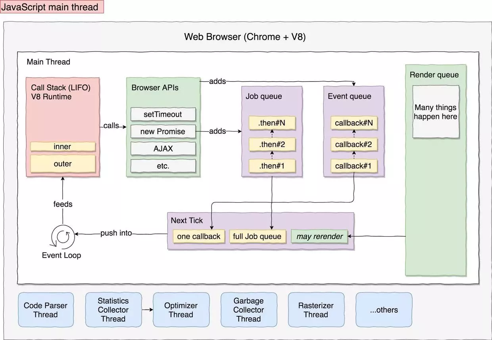

# 深入浏览器

为什么要深入浏览器？学习它有什么用？

答：规范我们写代码，保证 `link` 写在 `head`内部，操作dom的 `script` 写在body底部。为什么这么写？我们去了解一下浏览器渲染一个网页的步骤，以及如果不这么写会有什么后果

目录

[1. 浏览器基本构造](#1-浏览器基本构造)  
[2. 浏览器如何加载网页](#2-浏览器如何加载网页)  
[3. event loop](#3-event-loop)  
[4. 特例处理](#4-特例处理)  
[5. 参考文章](#5-参考文章)  

## 1 浏览器基本构造

> 浏览器的这些模块，指的都是浏览器的进程，一个标签页一个进程，内部渲染引擎启用多个进程，进程间存在服务化，不同浏览器实现差异巨大。用户看到的都是通过 gpu 绘制出来的

1. **用户界面**：地址栏、前进/后退按钮、书签栏、主页按钮、刷新/停止按钮 (除请求页面之后，其他所有内容都是属于用户界面)
2. **UI后端**：用于绘制页面的基本组件，包括 select 、input ... ， 使用操作系统的ui方法实现
3. **数据存储**：浏览器需要实现的有 cookie, localstorage, sessionstorage, cachestorage, indexedDB, websql, filesystem
4. **浏览器引擎**：协调 `ui后端` 与 `渲染引擎` 工作
5. **渲染引擎**：负责获取网页内容(html, xml, img, js, css)、生成 dom tree、生成样式表、生成 render tree，然后将内容展示在屏幕上
6. **js引擎**：解析和执行 js 来实现动态网页效果

> 问1：浏览器的 `网络模块` 和 `线程控制模块` 位于什么地方？
> 猜想：网络模块位于渲染引擎中，因为渲染引擎负责获取内容

### 1.1 内核

浏览器内核：渲染引擎、js引擎

> 通常所说的内核，就是浏览器的渲染引擎

trident: ie, 360兼容, 搜狗

gecko: firefox

webkit: safari, chrome老版

blink: chrome opera

> blink 属于 webkit 的一个分支  
> chromium 是 google 更新最快的浏览器，和 chrome 的关系，就像 @babel/preset-env 与 babel-preset-env 一样

### 1.2 chrome devtool 解析

在 chrome 中按 `f12` 可以调出开发者工具，可以看到顶部9个具名模块、图标模块

图标模块：主要用于辅助控制页面，包含选取元素、模拟运行环境(pc、手机、平板) ...

9个具名模块

1. Elements: 渲染成功的页面，包含html层级，对应选中dom节点的样式及盒子模型。(里面的 Event Listeners 、 DOM Breakpoints、Properties、Accessibility还没有怎么用过，大致知道什么意思)
2. Console: 控制台
3. Sources: 当前页面所有资源文件的源文件，就是 Elements 渲染成功之前对应的源文件(在这栏下面为js文件打断点可以进行调试)
4. Network: 可以查看资源文件请求对应的网络过程及分析
5. Performance：浏览器对资源文件的解析执行总体耗时，表现出来的是页面的性能。可以通过浏览器对应的api获取具体各性能时间
6. Memory: 监测运行时内存变化，主要是堆栈数据监测
7. Application: 对应当前应用的资源使用情况，包括manifest, service workers, storage, cache
8. Security: 安全页，如果采用https，可以在这里查看使用的证书、tls版本等信息
9. Audits: 页面检测，使用 chrome 开源的 lighthouse 对当前页面进行性能检测，包含 性能、pwa比例、accebility 等

### 1.3 GPU

> cpu、gpu 作为浏览器的2大核心

gpu: 图形处理单元，用于计算机 `图形处理` ，而 cpu 多用于常规计算处理。

gpu 加速计算：同时利用 gpu 和 cpu ，将计算密集部分放在 gpu 运行，cpu 运行其余代码。

gpu 图形处理器，显卡的处理器，显卡的核心部分。用于绘制图形，我们通过显示器看到的东西都是 gpu 绘制出来的。浏览器通过渲染引擎调用 gpu 执行渲染任务。

## 2 浏览器如何加载网页

1. 用户输入网址:  浏览器解析url，检查网址是否正确
2. 选择协议： 检查hsts列表, 采用 http 还是　https
3. dns 查询： 浏览器缓存(chrome://net-internals/#dns), dns 服务器查询(arp 协议)，获取目标 ip 地址
4. tls 4次握手： 见 2.1
5. tcp 3次握手： `syn` -> `syn + ack` -> `ack + data`
6. http 数据请求，服务器返回静态资源，通常是8k分块
7. dom tree:  浏览器渲染引擎从网络层取得html文档，内部的 HTML 解析器采用 html5 规范规定的解析算法解析文档，构建dom树
8. 样式表对象： 浏览器渲染引擎再次发起 http 请求，获取 html 文档中引入的 css、img、js 文件。css解析会被渲染引擎生成样式表对象， js 会被交给 js引擎处理
9. render tree: 浏览器渲染引擎将生成的 dom tree 和 样式表对象 结合，生成 render tree，每个节点对应有 css 样式值。
10. 页面渲染 见 2.2

> 问2：渲染引擎对于 html 文档及 css, img, js 之间的解析执行顺序是怎么样的？

1. html 文档先获取到，然后生成dom tree
2. 然后异步发起http请求，获取 css, img, js 文件，浏览器对发起的http请求个数由限制，大多是6个
3. 请求到的 js 文件，交给浏览器 js引擎处理
4. 渲染引擎是尽可能地将内容呈现到屏幕上，不会等到 dom tree 或 render tree 构建完成再渲染，它的机制是解析完一部分就显示一部分内容。所以渲染引擎的渲染，会根据浏览器执行的渲染算法不同而不同。(这也解释了一个现象，浏览器还在加载中，能出现一部分的页面结构)
5. 关于html解析中遇到 `script` 引入 js 时，会阻塞文档的解析，直到资源被请求到并且js被执行(所以都建议将script写在文末，保证html的解析优先)。可以设置 `defer` 属性，表示该资源在html解析过程中并行异步获取资源，在html解析完成之后才执行js。关于 `defer` 和 `async` 的区别可见 [深入html-标签语义化](../html/深入html-标签语义化.md)
6. 对于css样式表对象的生成，它是用于和dom树一起构建render树，通常建议将link标签写在header里面，保证样式表对象的生成是在dom树构建具体节点的时候，想要的样式已经请求到了。因为请求是同步进行的，如果将link写在body内部，可能在生成render树的时候，样式表资源都还没有请求到。补充：样式表请求不会阻塞dom的解析，但是会阻塞页面的渲染，怎么理解？浏览器会竟可能减少页面绘制次数，提升性能，提高用户体验。

> 外链css 不会阻塞 dom 解析，所以会照样生成 dom tree，但是会阻塞生成 render tree，浏览器会在所有样式表生成样式表对象之后，再来绘制 render tree
> 外链css 会阻塞 js 的执行，因为js需要获取节点的 css 信息，必须要等 render tree 生成之后，才能执行js
> `内联css` 、`缓存中的外链css` 不会阻塞 js 的执行，因为不存在网络延迟，不会发起http请求

html5规范规定：

1. script 标签引入的非 async、defer js 资源文件，必须按顺序解释执行，不是谁先请求到先执行
2. script 标签之前的 link 引入的 css 比如完全载入，js才会解释执行

### 2.1 tls 4次握手

> 如何加深理解？模拟一次 tls 4次握手

1. 客户端->服务端：`clientHello`、`tls版本`、`可用的加密算法集合`、`可用的压缩算法`、`第一个随机数`
2. 服务端->客户端：`serverHello`、`采用的tls版本`、`采用的加密算法`、`采用的压缩算法`、`ca证书，含公钥`、`第二个随机数`
3. 客户端->服务端: `确认加密结束`、`第三个随机数`、`ack`
4. 服务端->客户端：`确认加密`、`ack`

> 相比与 tcp 的3次握手， tls 的4次握手，就是多了 `tls版本`、`加密算法`、`压缩算法`、`ca证书及公钥`、`随机数`，每次会话都需要进行 tls 4次握手，所以 http2 采用了长链接
> 随机数作用：公钥只是用来加密，非对称加密；随机数用于每次会话生成对称加密；第三个随机数会用第二次握手服务器提供的公钥进行加密

**工作过程**：4次握手结束之后，然后就普通 http 通信了，不过数据都才用会话密钥进行加密传输。这里的会话密钥就是通过那3个随机数、采用的加密算法生成的。比如 RSA密钥交换算法 + 3个随机数 = 特定对称密钥

**公钥作用**：服务器提供的公钥，用于第三个随机数加密

**私钥作用**：服务器解密第三个随机数

**对称密钥作用**：握手之后的 http 通信数据加密

> 对称秘钥加密解密快，用于真实数据；非对称秘钥加密解密慢，只用于第三个随机数的加密解密。

### 2.2 页面渲染

关键词：dom tree, 样式表, render tree

当渲染引擎生成 render tree 之后，就该进行渲染了

1. 根据 render tree 自底向上，通过累加子节点的 width、padding、border、margin，计算每个节点的 preferred 宽度
2. 通过自顶向下，给每个子节点分配可行宽度，计算每个节点的实际宽度
3. 根据 render tree 自底向上，通过应用文字折行、累加子节点 height、padding、border、margin 计算每个子节点的高度
4. 如果元素使用 float、absolute、relative 属性时，进行特殊处理
5. 通过上面的计算结果，构建每个节点的坐标(用于绘制，减少gpu计算量)
6. 分层，成组绘制：将可以成组的部分，分配到同一层，表示同时绘制，每个对象都会被分配到对应的层。每个层有对应的绘制属性，层内部不会被cpu栅格化处理，层之间会被cpu栅格化处理
7. cpu栅格化处理：遍历每层每个对象，计算机执行绘图命令绘制，cpu栅格化处理，创建 `gpu命令` 缓冲区；由浏览器引擎协调 `ui后端` 和 `渲染引擎`，创建合适的 gpu命令
8. GPU绘制：cpu计算出每个层的最终位置，然后 `gpu命令` 缓冲区清空，然后 `gpu命令` 传至gpu，并异步渲染

问：浏览器 js 引擎如何处理 js 代码？

答：由 js 引擎解析，将js代码逐行解析，生成一个一个的任务，放入任务调用栈，然后任务执行完成出栈，可能生成 rerender 任务、microtask、macrotask ，放入任务队列

问：听说有 js 代码分段解析，怎么分段，一段多少？

答：分什么段？不分段，依次解析，单线程，逐行解析代码，生成任务，加入任务调用栈，任务执行完成出栈。这是一个解析-执行的过程，不是全部解析了之后再执行，是一边解析，一边执行，对不同作用域创建作用域链，对 var 声明变量做变量提升，对 function 声明函数做函数名提升

> 渲染引擎在解析过程中，遇到 js script 标签，会将之前生成任务调用栈中的任务执行完全，然后才去解析执行下一个 script 标签内的 js 代码，如下面代码所示。这个同外链加载 js 一样，在加载之前会将之前加载的 js 代码执行了。

```javascript
<script type="text/javascript">
    setTimeout(function(){
      console.log('setTimeout0')
    }, 0)
    console.log('shit')
    console.log(add.name) // Uncaught ReferenceError: add is not defined
    // 因为下面的js代码还没有解析，函数 add 还没有来得及函数声明提升，所以报错
</script>
<script type="text/javascript">
  function add(){}
</script>
```

## 3 event loop

在浏览器主线程中，事件调度如图所示



浏览器的主线程，穿插调用浏览器的各个组件，比如加载 html, css, js 的时候，会交替调用渲染引擎、浏览器引擎、ui后端、js引擎。当渲染结束，用户操作，会与浏览器进行交互，触发各种事件，这时也在主线程中进行，主要对这个阶段进行分析

****

**事件队列**：浏览器事件队列，也叫 `next tick` ，表示js引擎空闲的时候，才推进执行的任务。包含 `macrotask` 、 `microtask`、`rerendertask`

macrotask: dom event、setTimeout、setInterval

microtask: promise、MutationObserver

rerendertask: 渲染任务

根据上面图中事件队列入栈的顺序，可以看出 **优先级： rerendertask > microtask > macrotask**

> 即点击事件、ajax回调事件、promise任务都会被放入事件队列之中

**调用栈**：call stack，浏览器将js代码解释成一条一条的任务，放入任务调用栈，由js引擎(v8)维护、读取执行。当任务调用栈执行结束之后，event loop 模块会轮询然后会将 `事件队列中的任务` push到 `调用栈` 中

> 小循环：js引擎执行调用栈中的任务，产生事件任务，事件任务加入事件队列，在调用栈空闲(也可以说js引擎无任务执行)的时候，将事件队列中所有任务再放入调用栈

****

问3：什么时候 js 引擎会空闲？

答：当调用栈任务为空，需要执行事件队列中的任务了

问4：渲染引擎执行渲染任务，和js引擎执行call stack任务，2者有什么联系？

看这个例子，在浏览器运行过程中，它不会在2个颜色间变来变去，而是在循环结束之后，再去渲染，猜想原因是浏览器自己优化，节约性能。这也符合了上面主线程任务调度图中的 next tick 中的 rerendertask 任务

```javascript
const jsSpan = document.getElementById('jsSpan');
for(let i=1;i<99999;i++) {
    console.log(i%2)
    if(i%2 === 0) {
        jsSpan.style.backgroundColor = '#e81414'
    } else {
        jsSpan.style.backgroundColor = '#403e3e'
    }
}
```

答：js引擎执行的任务，如果是要操作dom，更新页面，会将渲染任务(rerendertask)放在next tick中，并且优先级最高

> 注意：这里的渲染任务，属于 rerendertask，和浏览器最初渲染引擎解析html,css生成的 render tree 的渲染任务不同，后者属于 rendertask，由渲染引擎直接解析

问5：当浏览器渲染引擎去获取图片、css时，如果网速慢，然后就会造成主线程阻塞，此时如果调用栈中有任务，js引擎会去调用执行吗？

场景模拟：使用 chrome，设置为 `low-end mobile`

```html
  <script type="text/javascript">
    setTimeout(function(){
      console.log('setTimeout')
    }, 0)
  </script>
  <link rel="stylesheet" href="https://cdn.bootcss.com/bootstrap/3.3.7/css/bootstrap.min.css" integrity="sha384-BVYiiSIFeK1dGmJRAkycuHAHRg32OmUcww7on3RYdg4Va+PmSTsz/K68vbdEjh4u" crossorigin="anonymous">
  <script type="text/javascript">
    console.log('next')
  </script>
```

执行结果描述：最先打印出的就是 `next`，然后才输出 `setTimeout`

场景模拟：使用 chrome，设置为 `low-end mobile`

```html
  <script type="text/javascript">
    setTimeout(function(){
      console.log('setTimeout')
    }, 0)
  </script>
  <script src="https://unpkg.com/babel-standalone@6/babel.min.js"></script>
  <script crossorigin src="https://unpkg.com/react@16/umd/react.production.min.js"></script>
  <script crossorigin src="https://unpkg.com/react-dom@16/umd/react-dom.production.min.js"></script>
  <script type="text/javascript">
    console.log('next')
  </script>
```

执行结果描述：最先打印出的就是 `setTimeout`，然后才输出 `next`

回答问题5：分析上面2种情况，一种是引入外链css，一种是引入外链js，就带来了2种不同的结果。前文提到的是，外链css会阻塞js的执行，因为js可能操作节点样式，浏览器做了一点优化，让css获取到并渲染结束再执行js。所以外链css会阻塞js的执行，阻塞的是js引擎的任务调度执行，这也解释了为什么第一个场景会先输出 `next` ，再输出 `setTimeout` 。那么为什么第二个场景又不同呢？第二个场景是加载js，此处加载js是由渲染引擎去加载并执行，它没有阻塞js引擎的任务调度，但是依然遵循渲染引擎对html的渲染，在加载完成之前会阻塞渲染，加载完成之后会执行加载的js，然后才会去解析执行后面的script标签内容。所以此处先输出 `setTimeout`，然后才输出 `next`。当浏览器渲染引擎去获取图片、css时，如果网速慢，然后就会造成主线程阻塞，此时如果调用栈中有任务，js引擎会不去调用执行，因为浏览器阻止了js引擎的任务调度

总结：**外链css会阻塞js引擎任务调度执行；外链js不会阻塞js引擎任务调度执行。但是不管是哪种阻塞，都会遵循html解析顺序，在获取到资源之前，后面的解析都会暂停**

## 4 特例处理

需求：同时渲染一个由 **十万条数据** 组成的列表，如何才能不卡死浏览器？

分析：

这里渲染肯定是通过js生成dom去渲染，而不是服务端渲染，不然就没有优化意义了。

为什么渲染十万条数据，就会卡死浏览器呢？

```javascript
const container = document.getElementById('container');
for(let i=0;i<100000;i++) {
    const p = document.createElement('p');
    p.innerHTML = 'hello world';
    container.appendChild(p);
}
```

因为js循环中生成的js任务，在放入任务调用栈中，js引擎在调度任务执行，每条任务需要去操作生成dom，此时会生成 rerendertask ，会被放入 `next tick` 中。在将调用栈中的所有任务调度执行结束之后，才会由 `event loop` 将事件队列中的任务加入调用栈中，由js引擎调度执行，此时才会执行渲染任务。

**问题点**：这里会执行一个10w次的循环，会耗费很长的计算时间，这个时间段不会执行渲染，所以我们看到的是一个卡死的页面，也不能执行其他的操作，比如用户点击事件都会放入事件队列中去，由 `next tick` 管理

**解决思路一**：这是一个调用栈与任务队列的调用处理顺序问题。如果将10w条数据分段处理，使用 `setInterval` 将任务分成200个子任务，每段500条，所有子任务进入事件队列。每个子任务执行生成 rerender 任务都放入事件队列中。因为 `rerendertask` 的优先级高于 `setInterval` 的，所以在下个子任务开始之前，上个子任务生成的 `rerendertask` 会由js引擎交由渲染引擎执行渲染。

**解决方案一**：

```javascript
    const container = document.getElementById('container');
    let i = 0, perRender = 500, total = 100000;
    const interval = setInterval(function() {
      if(i++ > total/perRender) {clearInterval(interval)}
      for(let i=0;i<perRender;i++) {
        const p = document.createElement('p');
        p.innerHTML = 'hello world'
        container.appendChild(p)
      }
    }, 0)
```

**解决思路二**：思路一提到的解决方案是将耗时高的长任务分片处理，放进macrotask队列中，让其优先级低于 rerendertask 。浏览器现在提供 worker ，即开放另一个线程，用于处理复杂计算任务。但是由于web workers是通过 postmessage 通信，如果计算量小的话，性能反而得不到提升。

## 5 参考文章

1. [what-happens-when](https://github.com/skyline75489/what-happens-when-zh_CN)
2. [漫步前端性能](https://juejin.im/post/5b729b55e51d456648449aa9)
