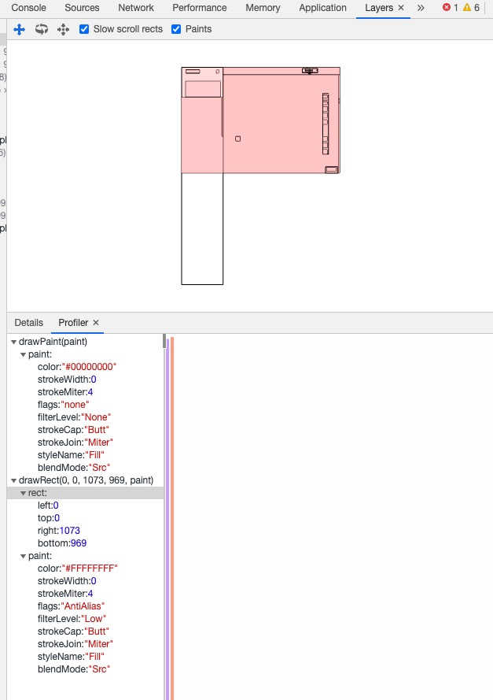

# 深入浏览器

为什么要深入浏览器？学习它有什么用？

答：规范我们写代码，保证 `link` 写在 `head`内部，操作dom的 `script` 写在body底部。为什么这么写？我们去了解一下浏览器渲染一个网页的步骤，以及如果不这么写会有什么后果

目录

[1. 浏览器基本构造](#1-浏览器基本构造)  
[2. 浏览器如何加载、渲染网页](#2-浏览器如何加载、渲染网页)  
[3. v8](#3-v8)  
[4. event loop](#4-event-loop)  
[5. 参考文章](#5-参考文章)  

关键词：需要对照浏览器、v8源码一起来看看具体实现

1. 浏览器进程
2. chrome-dev-too
3. 渲染流程
4. v8 js 执行流程

## 1 浏览器基本构造

这里总结一下 chrome 浏览器多进程架构

进程：独立的运行程序；作为计算机分配资源的单位；进程间通信叫做 `ipc 通信`  
线程：作为进程的执行单位，也就是计算机操作系统调用的单位，用于处理具体任务；一个进程有一个或多个线程

通过 chrome 浏览器的设置 -> 更多工具 -> 任务管理器，可以看到同操作系统提供的任务管理器一样，列出了进程树，不过这里展示的是浏览器相关进程

1. 浏览器进程：负责展示浏览器基本外观、内部进程协同工作。比如导航过程，浏览器进程通知网络进程获取资源文件，网络进程获取到文档资源，发起 ipc 通信给浏览器进程，浏览器进程通知渲染进程，渲染进程和网络进程文档连接，文档传输结束之后，渲染进程通知浏览器进程，浏览器进程停止加载图标、展示安全协议，浏览器进程通知渲染进程可以渲染了。整个过程由浏览器进程进行协调。每个渲染进程是运行在安全沙箱中的。
2. GPU 进程：同渲染进程联合绘制界面，主要承担更高性能的渲染
3. network 网络进程：负责发起网络请求获取资源，包含了 http、tcp、ip 等
4. audio 进程
5. 浏览器标签进程(渲染进程，render process)：通常一个标签页对应一个进程，如果是通过一个标签页打开另一个，可能就是共享一个进程了(如果是同源 same-site，则共享进程, process-per-site-instance)

### 1.1 内核

浏览器内核：渲染引擎、js引擎

trident: ie, 360兼容, 搜狗

gecko: firefox

webkit: safari, chrome老版

blink: chrome opera

> blink 属于 webkit 的一个分支  
> chromium 是 google 更新最快的浏览器，和 chrome 的关系，就像 @babel/preset-env 与 babel-preset-env 一样

### 1.2 chrome devtool 解析

在 chrome 中按 `f12` 可以调出开发者工具，可以看到顶部9个具名模块、图标模块

图标模块：主要用于辅助控制页面，包含选取元素、模拟运行环境(pc、手机、平板) ...

9个具名模块

1. Elements: 渲染成功的页面，包含html层级，对应选中dom节点的样式及盒子模型。(里面的 Event Listeners 、DOM Breakpoints、Properties、Accessibility还没有怎么用过，大致知道什么意思)
2. Console: 控制台，输出或执行 js 代码、浏览器相关信息
3. Sources: 当前页面所有资源文件的源文件，就是 Elements 渲染成功之前对应的源文件(在这栏下面为js文件打断点可以进行调试)
4. Network: 可以查看资源文件请求对应的网络过程及分析
5. Performance：浏览器对资源文件的解析执行总体耗时，表现出来的是页面的性能。主要用于运行时性能分析。可以通过浏览器对应的api获取具体各性能时间
6. Memory: 监测运行时内存变化，主要是堆栈数据监测，查看内存泄漏相关信息
7. Application: 对应当前应用的资源使用情况，包括manifest, service workers, storage, cache
8. Security: 安全页，如果采用https，可以在这里查看使用的证书、tls版本等信息
9. Audits/lighthouse: 页面检测，使用 chrome 开源的 lighthouse 对当前页面进行性能检测，包含 性能、pwa比例、accebility 等。可用于加载时性能分析，点击 trace 进入 performance 分析 fp, fcp, lcp 等

### 1.3 GPU

> cpu、gpu 作为浏览器的2大核心

gpu: 图形处理单元，用于计算机 `图形处理` ，而 cpu 多用于常规计算处理。

gpu 加速计算：同时利用 gpu 和 cpu ，将计算密集部分放在 gpu 运行，cpu 运行其余代码。

gpu 图形处理器，显卡的处理器，显卡的核心部分。用于绘制图形，我们通过显示器看到的东西都是 gpu 绘制出来的。浏览器通过渲染引擎调用 gpu 执行渲染任务。浏览器主进程读取 gpu 缓存图片并显示图片。

## 2 浏览器如何加载、渲染网页

### 2.1 浏览器加载网页

1. 用户输入网址:  浏览器解析url，检查网址是否正确
2. 选择协议： 判断采用 http 还是　https
3. dns 查询： 浏览器缓存(chrome://net-internals/#dns), dns 服务器查询(arp 协议)，获取目标 ip 地址
4. tls 4次握手： 见 2.1
5. tcp 3次握手： `syn` -> `syn + ack` -> `ack + data`
6. http 数据请求，服务器返回静态资源，通常是8k分块
7. 页面渲染 见 2.3

***

**问2：渲染引擎对于 html 文档及 css, img, js 之间的解析执行顺序是怎么样的？**

1. html 文档先获取到，然后生成dom tree
2. 然后异步发起http请求，获取 css, img, js 文件，浏览器对发起的http请求个数由限制，大多是6个
3. 请求到的 js 文件，交给浏览器 js引擎处理
4. 渲染引擎是尽可能地将内容呈现到屏幕上，不会等到 dom tree 或 render tree 构建完成再渲染，它的机制是解析完一部分就显示一部分内容。所以渲染引擎的渲染，会根据浏览器执行的渲染算法不同而不同。(这也解释了一个现象，浏览器还在加载中，能出现一部分的页面结构)
5. 关于html解析中遇到 `script` 引入 js 时，会阻塞文档的解析，直到资源被请求到并且js被执行(所以都建议将script写在文末，保证html的解析优先)。可以设置 `defer` 属性，表示该资源在html解析过程中并行异步获取资源，在html解析完成之后才执行js。关于 `defer` 和 `async` 的区别可见 [深入html-标签语义化](../html/深入html-标签语义化.md)
6. 对于css样式表对象的生成，它是用于和dom树一起构建render树，通常建议将link标签写在header里面，保证样式表对象的生成是在dom树构建具体节点的时候，想要的样式已经请求到了。因为请求是同步进行的，如果将link写在body内部，可能在生成render树的时候，样式表资源都还没有请求到。补充：样式表请求不会阻塞dom的解析，但是会阻塞页面的渲染，怎么理解？浏览器会竟可能减少页面绘制次数，提升性能，提高用户体验。

> 外链css 不会阻塞 dom 解析，所以会照样生成 dom tree，但是会阻塞生成 render tree，浏览器会在所有样式表生成样式表对象之后，再来绘制 render tree
> 外链css 会阻塞 js 的执行，因为js需要获取节点的 css 信息，必须要等 render tree 生成之后，才能执行js
> `内联css` 、`缓存中的外链css` 不会阻塞 js 的执行，因为不存在网络延迟，不会发起http请求

html5规范规定：

1. script 标签引入的非 async、defer js 资源文件，必须按顺序解释执行，不是谁先请求到先执行
2. script 标签之前的 link 引入的 css 必须完全载入，js才会解释执行

### 2.2 tls 4次握手

> 如何加深理解？模拟一次 tls 4次握手

1. 客户端->服务端：`clientHello`、`tls版本`、`可用的加密算法集合`、`可用的压缩算法`、`第一个随机数`
2. 服务端->客户端：`serverHello`、`采用的tls版本`、`采用的加密算法`、`采用的压缩算法`、`ca证书，含公钥`、`第二个随机数`
3. 客户端->服务端: `确认加密结束`、`第三个随机数`、`ack`
4. 服务端->客户端：`确认加密`、`ack`

> 相比与 tcp 的3次握手， tls 的4次握手，就是多了 `tls版本`、`加密算法`、`压缩算法`、`ca证书及公钥`、`随机数`，每次会话都需要进行 tls 4次握手，所以 http2 采用了长链接
> 随机数作用：公钥只是用来加密，非对称加密；随机数用于每次会话生成对称加密；第三个随机数会用第二次握手服务器提供的公钥进行加密

工作过程：4次握手结束之后，然后就普通 http 通信了，不过数据都才用会话密钥进行加密传输。这里的会话密钥就是通过那3个随机数、采用的加密算法生成的。比如 RSA密钥交换算法 + 3个随机数 = 特定对称密钥  
公钥作用：服务器提供的公钥，用于第三个随机数加密  
私钥作用：服务器解密第三个随机数  
对称密钥作用：握手之后的 http 通信数据加密

> 对称秘钥加密解密快，用于真实数据；非对称秘钥加密解密慢，只用于第三个随机数的加密解密。

### 2.3 页面渲染

渲染阶段包含了如下子阶段，每个子阶段都有输入输出，页面渲染也是一个多阶段流水线过程

1. 构建 dom tree
2. 样式计算：生成 styleSheets、dom 节点样式 (calculate)
3. 布局：生成包含几何坐标信息的 render tree (layout)
4. 分层：生成 layer tree (layer)
5. 绘制：输出层绘制指令队列 (paint - 生成绘制指令队列)
6. 栅格化处理：图层拆分图块，将图块生成位图，保存在 gpu 缓冲区 (composite layers)
7. 显示图片：合成线程与浏览器通信，浏览器进程展示图片

### 2.3.1 构建 dom tree

渲染引擎解析文档 html 结构，生成 dom 对象树

### 2.3.2 样式计算

1. 样式处理：将 css 文件解析成样式对象树 cssom，也叫做 `styleSheets`
2. 样式标准化：将 css 样式标准化为渲染引擎方便识别的方式，比如 bold 会转化为具体 rgba 颜色值;  
2. dom 节点样式计算：这里处理了 css 特性：继承、层叠，为每个 dom 节点计算自身样式，样式保存在自身 `ComputedStyle` 属性中

输入：dom tree  
输出：包含节点样式对象属性的 dom tree

> 如果是 recalculate 计算，比如回流和重绘，还通常伴有 hit test (计算点击元素最小触发节点算法)、触发 animation frame 事件等子阶段

### 2.3.3 布局阶段

1. 遍历 dom tree，将所有可见节点、伪元素集合构建一颗 render tree
2. 根据 render tree 自底向上，通过累加子节点的 width、padding、border、margin，计算每个节点的 preferred 宽度
3. 通过自顶向下，给每个子节点分配可行宽度，计算每个节点的实际宽度
4. 根据 render tree 自底向上，通过应用文字折行、累加子节点 height、padding、border、margin 计算每个子节点的高度
5. 如果元素使用 float、absolute、relative 属性时，进行特殊处理
6. 通过上面的计算结果，构建每个节点的坐标(用于绘制，减少gpu计算量)，数据还是保存在 render tree 中

输入：dom tree  
输出：包含几何坐标信息的 render tree

### 2.3.4 分层

在 render tree 计算完 dom 的几何位置之后，需要计算各节点所处页面分层情况。这里需要知道，浏览器绘制显示页面，同 ps 一样，也是有一个图层效果，可以通过浏览器 `layers` 来查看具体 3d 图层效果

那么，浏览器是怎么规划图层的呢？我们定义 css 样式，哪些会新建一个图层，哪些会应用在父图层上？图层多少有什么影响？

渲染引擎在生成包含 dom 几何位置的 render tree 之后，就会根据节点的 css 样式，构建一颗 layer tree。layer tree 相较于 render tree，就是每个 dom 节点包含了所属图层信息

输入：render tree  
输出：layer tree

***

dom 新图层成立条件：节点拥有层叠上下文属性，包括节点带有三维效果的样式属性、展示部分内容的属性(裁剪、滚动)

1. <html> 标签创建基础图层
2. position: absolute | relatice 且 z-index 不为 auto
3. position: fixed, sticky
4. flex 容器的子元素：flex 容器还是不会新建图层，只是如果 z-index 不为 auto，它的子元素位于新的图层
5. grid 容器的子元素：grid 容器还是不会新建图层，只是如果 z-index 不为 auto，它的子元素位于新的图层
6. opacity 值小于1的元素
7. mix-blend-mode 值不为 normal 的元素：这个属性指明与父节点的内容、背景如何混合(没有用过，不知道啥用)
8. 明确 3d 转换元素：transform, filter, perspective
9. 明确裁剪元素：clip-path, mask
10. isolation：是否新建图层，通常用于和 mix-blend-mode 混合背景搭配
11. -webkit-overflow-scrolling: touch 会新建
12. will-change
13. contain: content，strict，layout，paint 用于指明某快元素脱离文档流，在内部改变时，不会影响到界面的其他部分，浏览器可以按需渲染
14. 可滚动区域的滚动条

### 2.3.5 分层绘制

输入：layer tree  
输出：绘制指令队列

在分层处理之后，生成了一颗 layer tree，那接下来就是生成绘制指令队列。  
渲染引擎遍历 layer tree，每一个图层都将对应多条绘制指令，这个取决于图层的复杂度。  
每一条绘制指令就是执行一次简单的绘制操作



如图所示，Profiler 就是指令队列，每一条指令是一次简单的 paint 操作，比如绘制底色、矩形

问题：浏览器执行了分层，生成 layer tree，然后又生成绘制指令队列，分层数量多少有什么影响？

### 2.3.6 栅格化处理

合成及生成绘制指令都是在渲染进程的主线程中实现，而实例处理绘制指令队列的是 `合成线程`。

输入：包含绘制指令队列的 layer tree  
输出：位图

合成线程：将收到的 layer tree 划分为图块(一个图层包含多个图块，每一个图块由多个绘制指令构成)，每次只将浏览器 viewport 中的图块交给栅格化线程  
栅格化线程：输入图块，然后与 gpu 进程进行 ipc 通信，将图块包含的绘制指令递交给 gpu，gpu 生成图片并保存在自身缓冲区中(gpu raster)

> 光栅化：也就是将图块转换成图片的过程

### 2.3.7 浏览器主进程显示图片

待合成线程所有图块光栅化结束，合成线程同浏览器主进程通信，通知主进程去读取 gpu 缓冲区内容，通过像素点展示在显示器屏幕上。

## 3 V8

### 3.1 js 执行机制

1. 代码编译阶段：也称为代码扫描，同其他代码编译不同，这里是由 js 引擎处理执行，用于构建代码的 `执行上下文` 环境对象，主要处理变量提升、创建作用域链、this对象指向
2. 代码执行阶段：执行具体 js 逻辑代码，对变量处理时，去执行上下文环境读取对象数据。并且只会在自身执行上下文中去读取对象数据，不会跨调用栈读取数据。

调用栈：保存各作用域的执行上下文对象。全局执行上下文环境对象会被压入栈底，遇到函数或其他作用域，会创建新的执行上下文对象，并压入调用栈。

具体阶段流程：

1. 源代码
2. 生成 ast 语法树：通过词法分析、语法分析，生成 ast 语法树。ast 是解释器能识别的数据结构，而源代码是不能被识别的。
3. 生成执行上下文对象：根据 ast 生成执行上下文对象
3. 生成字节码文件：通过解释器 `Ignition`，解释 ast 语法树生成字节码文件。字节码是一种特别结构的代码，与机器无关，不能被机器直接执行。
4. 生成机器码：Ignition 逐行解释执行字节码文件，生成计算机可识别的机器码。可以理解为汇编语言处理结果的机器码，计算机能识别机器码、二进制码
5. jit：执行优化技术，发现热点代码，则通过编译器 `turbofun` 将这段代码编译成一段机器码缓存起来，下次解释器处理字节码遇到时，直接读取这段机器码

> 具体 ast 的应用，可以结合 babel, eslint 来看

### 3.2 隐式转换

弱类型语音支持隐式转换，强类型语言不支持隐式转换。  
静态类型语言也有是弱类型的，比如 c、c++。

### 3.3 内存分配

代码空间：存储代码语句  
栈空间：存储调用栈，也就是存储的执行上下文对象，保存了变量数据。其中引用类型在这里保存的是一个引用地址值  
堆空间：保存引用类型数据的真实值

> 渲染引擎在解析过程中，遇到 js script 标签，会将之前生成任务调用栈中的任务执行完全，然后才去解析执行下一个 script 标签内的 js 代码，如下面代码所示。这个同外链加载 js 一样，在加载之前会将之前加载的 js 代码执行了。

```javascript
<script type="text/javascript">
    setTimeout(function(){
      console.log('setTimeout0')
    }, 0)
    console.log('shit')
    console.log(add.name) // Uncaught ReferenceError: add is not defined
    // 因为下面的js代码还没有解析，函数 add 还没有来得及函数声明提升，所以报错
</script>
<script type="text/javascript">
  function add(){}
</script>
```

## 4 event loop

[事件循环](./深入浏览器-事件循环.md)  见该文章详细说明

## 5 参考文章

1. [what-happens-when](https://github.com/skyline75489/what-happens-when-zh_CN)
2. [漫步前端性能](https://juejin.im/post/5b729b55e51d456648449aa9)
3. [mdn 分层渲染](https://developer.mozilla.org/zh-CN/docs/Web/Guide/CSS/Understanding_z_index/The_stacking_context)
