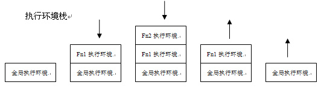

# 执行上下文

目录

1. 概念
2. 执行环境类型
3. 创建过程

## 1 概念

什么是执行上下文？

执行上下文也叫做执行环境，由js引擎(js解释器)创建，当引擎解析执行一段可执行代码时，会为这段代码创建一个运行环境，这个运行环境就叫做执行上下文。(每段可执行代码的执行有2个阶段，初始化阶段和执行阶段)

执行上下文包含了当前环境中的作用域链、变量对象vo、this。(可以简单理解执行上下文就是一个大对象)

## 2 执行环境类型

由于javascript代码分为3种类型：`全局`、`函数`、`eval`

所以执行环境也分成3种：`全局执行环境`、`函数执行环境`、`eval执行环境`

作用域也分成3种：`全局作用域`、`局部作用域`、`eval作用域`

局部作用域分为：`函数作用域`、`块级作用域`

> 块级作用域针对 let, const 起效

## 3 创建过程

首先接触到的是全局环境，解释器初始化代码时创建一个全局执行环境，然后将其压入执行上下文栈。

接下来遇到函数执行，函数初始化时就为其创建一个函数执行环境，将其压入执行上下文栈

例子解释

```javascript
function Fn1() {
    function Fn2() { console.log(document.body.tagName) }
    Fn2();
}
Fn1();
```

执行环境栈变化过程：[图片来源](http://www.cnblogs.com/fool/archive/2010/10/16/1853326.html)



创建执行上下文内部的 `作用域链` 及 `变量对象VO` 可以参见 [深入js-词法作用域](./深入js-作用域.md)

## 4 块级作用域

在创建执行上下文时，除了全局执行上下文对象外(var, function 声明)，还会在内部会创建多个词法上下文对象，用以保存 let、const、import、class 声明的变量。

词法上下文对象，也叫做暂时性死区，所以同 var 的变量提升不同。

> 相关文章：[深入js-词法作用域](./深入js-词法作用域.md)
