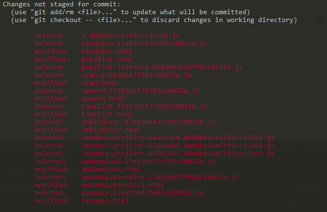

# git 常见问题及答案

这里记录我平时使用git中遇到的问题及解决方式

目录

[1 保存用户名及密码](#1-保存用户名及密码)  
[2 不保存用户名密码](#2-不保存用户名密码)  
[3 拉取远程新增分支](#3-拉取远程新增分支)  
[4 push 时省略远程库及分支名](#4-push-时省略远程库及分支名)  
[5 查看本地所有分支](#5-查看本地所有分支)  
[6 如何同时使用多个git仓库](#6-如何同时使用多个git仓库)  
[7 分支管理问题-分支切换文件拉不下来](#7-分支管理问题-分支切换文件拉不下来)  
[8 不小心 add 了文件](#8-不小心-add-了文件)  
[9 pull 时机问题](#9-pull-时机问题)  
[10 新建本地项目与远程库关联问题](#10-新建本地项目与远程库关联问题)  
[11 windows文件名大小写忽略](#11-windows文件名大小写忽略)  
[12 git merge 及冲突解决](#12-git-merge-及冲突解决)  
[13 更新本地远程分支](#13-更新本地远程分支)  
[14 git pull 冲突](#14-git-pull-冲突)  

## 1 保存用户名及密码

`git config --global credential.helper store`

## 2 不保存用户名密码

`git config --global credential.helper cache`

关闭当前 git 操作环境，重新打开，就需要用户名密码了

## 3 拉取远程新增分支

`git fetch origin`：会将远程库新增的分支拉取到本地

拉取之后，只是获取到远程分支的信息，并没有在本地创建与之关联的分支，即修改代码之后提交不到该远程分支

需要先在本地创建一个与之关联的分支，然后再提交到该远程分支

命令： `git checkout -b master20180912 remotes/http/master20180912`

说明：

1. http 是我为本地仓库设置的远程git仓库的 `http` 方式连接信息，通过 `git remote -v` 查看
2. remotes/http/master20180912 是新建的远程分支，本地不存在
3. 该命令能够在本地创建一个与新建的远程分支相关联的分支，并把该远程分支拉下来

> 删除本地分支：git branch -d [分支名]

## 4 push 时省略远程库及分支名

`git push --set-upstream origin master`

## 5 查看本地所有分支

`git branch -a`

## 6 如何同时使用多个git仓库

即 git 仓库嵌套

1. 在父 git 库里面执行 `clone` 子库
2. 修改 clone 下来的子库名称

在父库里面，对应的 `remote -v` 是父库的远程库地址；

进入子库目录，对应的 `remote -v` 是子库的远程库地址；

## 7 分支管理问题-分支切换文件拉不下来

time: 2018.9.18

描述(场景)：

本地库存在2个分支，每个分支里面嵌入的是一个git库，对应另一个远程库，即第6点嵌入的仓库。

分支管理中，修改bug时，需要同时在分支和 master 上提交这个功能，不能采用 merge 方式；

**问题**：在本地开发环境中提交代码到git库上，在分支上 pull 代码之后，提交分支代码；然后 checkout 到 master 主分支上，发现 master 上的代码已经被改变了，然后 pull 代码下来，总是提示已经是最新的部分了，但是文件又不是和git库上的一致，然后 `git status` 之后发现又有改动的地方。

**发现**：观察 git status 变化的部分，发现它是将之前分支拉下来的代码给 delete 掉了，然后换成了当前 master 分支原本的代码。



**解答**：其实文件在分支的时候就已经全部拉下来了，保存在本地分支库中，然后切换分支的时候，又把它删除了，回到目标分支原有的状态，但是这个嵌入的库受到父库的影响，必须要保持跟原本水平一致。所以切换分支的时候，父库是没有变化的，但是进入分支的子库，却发现已经变化了。  
切换后的目标分支子库之所以文件变化，因为受到父库的影响，必须变化，所以子库的文件发生了变化。

总结：嵌入的库，如果父库存在多个分支，那么这个库受到父库的所有分支的影响，父库的分支策略不变，该嵌入的库在一次更新的时候，是把代码更新下来了的。之前认为父库的每个分支对应一个嵌入的子库，现在才发现其实父库的每个分支也只对应这同一个子库。

**解决办法**：这是属于不同分支对应同一个嵌套库的问题。1. 进入子库，将子库数据删完，重新拉取；2. 进入子库，执行 `git checkout .` 将变化的部分全部取消掉，恢复子库状态就行。

## 8 不小心 add 了文件

time: 20189.11.30

通常不小心使用 `git add .` 将所有文件添加到了暂存库，怎么撤销呢？

使用 `git reset HEAD` 让暂存库回滚到上次　commit 状态

## 9 pull 时机问题

time: 2018.12.1

在多人合作的时候，容易出现代码冲突，所以在每次修改完需要 push 的时候，都会先 pull 一次代码。

pull 是在 add 之前，还是在 commit 之后呢?

当然是 **add 之前**，此时修改的代码还存在于临时修改区中，pull下来的代码直接会合并到本地库中，如果此时有冲突的，还能废气本地临时修改。  
如果在 commit 之后，此时修改的代码已经合并到本地库了，然后 pull 下来的代码会和本地库起冲突，但是还是会拉下来，但是存在冲突的文件怎么办？如果使用 `git reset HEAD` 回滚到上次 commit 的位置，拉下来的代码又存在于临时修改区了。本次解决是直接删掉库，因为自己修改的不多，重新拉取再修改则可。

git 回滚命令还是不熟，需要对 git 整个生命周期节点熟悉后才能更好解决问题。

## 10 新建本地项目与远程库关联问题

time: 2018.12.12

问题描述：在新建远程库、新建本地库之后，需要将2个库关联起来，在本地采用如下命令

```bash
git init
git add .
git commit -m "init project"
git remote add origin https://xxx.xxx.xx.git
git push origin master
```

这样子会报错，提示 `Couldn't find remote ref master`

问题解答：报这个错，是因为远程库也是新的，并没有内容。该采用这个命令 `git push -u origin master` ，目的是将本地的 master 分支推到远程 origin ，并指定 origin 为默认地址

## 11 windows文件名大小写忽略

time: 2019.3.4

在 windows 平台会忽略文件名大小写，而 linux 则不会。

问题描述：将已经存在的文件名 `existFile.md` 改成 `ExistFile.md`，在 windows 平台提交代码的时候，使用 `git status` 命令是查看不到文件的变化的

问题解答：使用 `git config core.ignorecase false` 开启 windows 对文件名大小写敏感问题，然后就可以查看到对应变化，提交代码

后续问题：提交代码之后，会发现在 gitlab 上同时存在 `ExistFile.md` 和 `existFile.md`，此刻如果直接去删除文件，别人 `git pull` 代码之后，会发现那几个文件消失了，因为别人也用的 windows 平台，没有开启大小写敏感。

临时解决方案：让 `ExistFile.md` 和 `existFile.md` 同时存在

## 12 git merge 及冲突解决

time: 2019.3.29

以前没有怎么解决过分支版本合并冲突，今天遇到了合并冲突问题，这里记录一下

问题描述：  
存在 dev 和 feature 2个分支，feature 是自己的开发分支，dev 是发布测试分支，大家都会往 dev 分支上发代码。  
现在自己要将 feature 的代码合并到 dev 上面，但是产生了冲突，别人也已经修改了相同的文件。 
我最先是在线合并，但是合并后，会将2者合并的结果同步到2个 dev 和 feature 分支上，出现了问题

原则：  
1. dev 是测试分支，大家都可以发
2. feature 是自己的分支，不能合并 dev 到自己分支来。后面自己要发布到预发布环境上去，是只发自己的功能

git 回滚

1. git log -5：找到最近提交的自己的分支
2. git reset --hard [commit]：回滚到自己的之前提交点
3. git push -f origin feature：强行提交代码更新

正确的合并步骤

1. git checkout dev : 切换到本地dev分支
2. git merge origin/feature : 合并远程 feature 分支到本地 dev 分支
3. 打开编辑器，解决冲突:会有明显的提示，可以代码穿插，自行选择
4. npm run dev : dev 本地验证
5. git push：更新到远程分支dev

> 在 git merge xxx ，合并别人分支的时候，不能使用 git log 立马查看到别人的提交过程，需要提交合并后的结果之后才能看到别人的提交 log

管理别人分支：上面总结的是将自己的分支合并到主分支去，现在是要将别人分支合并到我的分支上来

1. git merge feature/f1 ，不使用 git merge origin feature/f1 这种方式合并远程分支，而是合并本地分支，如果非要合并远程分支，则将 origin 与分支名连接在一起，比如 get merge origin/feature/f1
2. 通常是将主分支合并到当前开发分支，然后解决冲突并提交代码，再发起 merge request ，合并时删除当前开发分支

## 13 更新本地远程分支

`git remote update origin --prune`

## 14 git pull 冲突

当使用 `git pull` 时，如果多人同时修改一个文件，那么就会造成 conflict ，也就是冲突，导致 pull 不下来代码，那么如何解决这个问题呢？

早起我是将冲突的文件 copy 出来，记住自己修改的部分，然后 `git checkout [file]` 将自己修改的文件还原，然后再 pull 代码，最后将自己的代码添加进去

后面考虑到这个不是一个很好的解决办法，如果自己不知道自己改了哪些代码呢？就需要一个更好的方案

使用如下操作：  
1. `git stash` 将自己本次修改添加到 stash 区，然后当前分支会回滚到上次 commit 的位置
2. `git pull` 拉取代码
3. `git stash pop` 将自己的修改从 stash 区检出
4. 修复冲突代码

