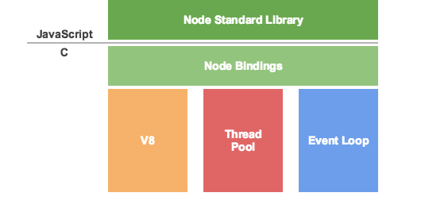

# nodejs 基本原理

架构



3大基础要点：v8、Thread Pool、Event Loop

> 归纳：nodejs做为javascript运行环境，javascript是单线程的，说它在识别、解释代码的时候(接受任务)，是单线程的，但它在从任务队列中获取执行具体任务的时候是多线程的，会将不同的任务分配给不同的线程处理

目录

[1. 简介](#1-简介)  
[2. Thread Pool](#2-Thread-Pool)  
[3. event loop](#3-event-loop)  
[4. http.IncomingMessage](#4-http.IncomingMessage)  
[5. stream](#5-stream)  
[6. events](#6-events)  
[7. error](#7-error)  

## 1 简介

nodejs 运行机制：  
1. 内置 v8 ，所以可以跑 js 代码
2. 基于 libuv，js 可以支持 io、线程池、event loop 功能

> Node.js 不是一门语言也不是框架，它只是基于 Google V8 引擎的 JavaScript 运行时环境，同时结合 Libuv 扩展了 JavaScript 功能，使之支持 io、fs 等只有语言才有的特性，使得 JavaScript 能够同时具有 DOM 操作(浏览器)和 I/O、文件读写、操作数据库(服务器端)等能力，是目前最简单的全栈式语言。

优点：  
1. 异步i/o，擅长做 i/o 密集型任务
2. 擅长做低延迟网络应用

缺点：  
1.  CPU 密集任务处理的不是很好

nodejs 的**主要特点**：事件驱动、单线程、异步i/0

> 单线程怎么解释？  
> 执行 js 代码是单线程(event loop)，但是做 i/o 是丢给线程池来处理(async i/o)，属于多线程的

## 2 Thread Pool

指的是异步 i/o 线程池

## 3 event loop

nodejs 的大部分api都是属于event loop的。许多都是 `EventEmitter` 类的实例，比如 `net.Server` , `fs.ReadStream` 等，都是采用了 `eventEmitter.on()` 方法用于注册监听器，然后用 `eventEmitter.emit()` 方法用于触发事件。

关键词：`process.nextTick`  `事件队列` `非阻塞i/o`

### 3.1 nodejs 中的 event loop

time: 2018.11.09

先学习 nodejs 的事件

### 3.2 process.nextTick(func)

nodejs 事件循环，本次循环中，在调用栈任务执行完毕之后，在异步任务队列执行之前，会优先执行 nextTick 的任务，所有 nextTick 任务会在本轮事件循环中执行。并且 nextTick 任务的执行，会阻塞所有的 i/o 。

问：nextTick 内部嵌套的 nextTick 任务什么时候执行？  
答：本轮事件中执行，也是优先于任务队列的其他任务的执行。因为在执行完毕调用栈中的任务时，会优先将 nextTick 中的任务放入调用栈中，让 v8 解释执行，如果此时又遇到 nextTick 任务，那么将其加入本轮事件循环，在当前 nextTick 任务执行完毕后，又会去判断，是否还有 nextTick 任务，如果没有，才会去执行异步任务队列中的其他任务。

### 3.3 nodejs eventloop vs browser eventloop

## 4 http.IncomingMessage

由 `http.createServer(callback)` 创建，可以在 callback 回调函数中使用 http.IncomingMessage 和 http.ServerResponse 2个对象，对应 koa 中就是 ctx.req 和 ctx.res 这2个对象，注意不是 ctx.request 和 ctx.response。http.IncomingMessage 实现了 `可读流` 接口。

## 5 stream

nodejs 提供了多种流对象，例如 `http 服务器的请求` 和 `process.stdout` 都是流的实例。所有流都是 `EventEmitter` 的实例

### 5.1 什么是流

问题：流是什么类型，是一个对象吗，还是说只是一个概念？

答：nodejs 创建的流都是字符串或者 Buffer 的。自己实现的流也可以使用其他类型的 javascript 值(除了 null)。这些流默认是以对象模式进行操作

> Buffer 是一个对象，用于暂存二进制数据。所以说流就是二进制数据对象集合或者字符串

### 5.2 流的缓冲

问：在使用 fs.createWriteStream 时，创建的流位于什么地方，最终是如何保存为一个文件的？

> 文件在网络传输中是以二进制数据传输的

答：可写流和可读流都会在内部的缓冲器中存储数据，然后由 writable.writableBuffer 或 readable.readableBuffer 来获取。

因为 Duplex 和 Transform 都是可读又可写的，所以他们维护着2个相互独立的内部缓冲器用于读取和写入。所以说现在缓冲器有3种

1. 可读缓冲器
2. 可写缓冲器
3. 可读又可写缓冲器

### 5.3 流的基本类型

1. Writable：可写入数据的流，比如 fs.createWriteStream()
2. Readable：可读取数据的流，比如 fs.createReadStream()
3. Duplex：可读又可写的流，比如 net.Socket
4. Tranform：读写过程中可以修改，或转换数据的 Duplex 流，比如 zlib.createDeflate()

## 6 events

time: 2018.11.19

update: 2018.11.20

单独拿 events 出来，是因为 nodejs 所有能触发事件的对象都是 `EventEmitter` 类的实例，比如 net.Server 会在每次有新连接的时候触发事件，fs.ReadStream 会在文件被打开时触发事件

```javascript
// events on-emit 模式
const EventEmitter = require('events');

class MyEmitter extends EventEmitter {}

const myEmitter = new MyEmitter();
myEmitter.on('event', () => {
  console.log('触发事件');
});
myEmitter.on('error', (e) => {
  console.log(e);
});
myEmitter.emit('event');
```

1. this 绑定：this 在监听回调事件中，默认指向 myEmitter 实例；如果是箭头函数，this指向是全局对象 global ，不是实例
2. 事件同步、异步调用：默认是按照监听器注册的顺序同步调用所有监听器，使用 `setImmediate` 或 `process.nextTick` 切换到异步(这里涉及到nodejs 的 [event loop](#3.1-nodejs-中的-event-loop))
3. eventEmitter.once()：执行一次

## 7 error

## 参考文章

1. [nodejs 官网 event loop](https://nodejs.org/en/docs/guides/event-loop-timers-and-nexttick/)
2. [阮一峰-再谈event loop](http://www.ruanyifeng.com/blog/2014/10/event-loop.html)
3. [nodejs 官网](http://nodejs.cn/api/)
4. [狼叔：如何正确的学习Node.js](https://cnodejs.org/topic/5ab3166be7b166bb7b9eccf7)
5. [nodejs 中文网入门教程](http://nodejs.cn/learn/differences-between-nodejs-and-the-browser)
6. [nodejs 官方指南](https://nodejs.org/zh-cn/docs/guides/)
