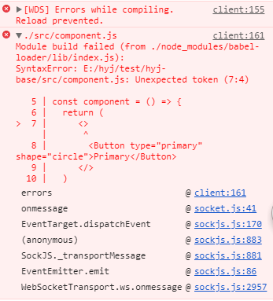

# react 应用技巧

time: 2018.8.02

update: 2018.8.07

## 1 ref 属性

15版本之前：ref 属性设置方式 `ref={this.myRef}`

15及以后版本：ref 属性设置方式 `ref = {(input) => {this.input = input}}`

应用技巧及场景

```javascript
// 在使用 antd 提供的 input 时，直接向input设置默认值，不用再通过 this.input.value 方式设置默认值了
<Input ref={(input) => { input&&(input.refs.input.value = modalGlobalShares.selectedEnterprise.permissionNumber); }} />
```

## 2 React.Fragment

该功能再 react 16 版本以上引入，用以解决需要返回多个child问题

```javascript
return (
  <React.Fragment>
    <Button type="primary" shape="circle">Primary</Button>
  </React.Fragment>
)
```

它的语法糖：`<></>`

```javascript
return (
  <>
    <Button type="primary" shape="circle">Primary</Button>
  </>
)
```

问题：我直接使用它的语法糖会报错，它的语法糖为什么不能直接使用？



答：目前的 babel-preset-react 还没有来得及支持该语法糖
