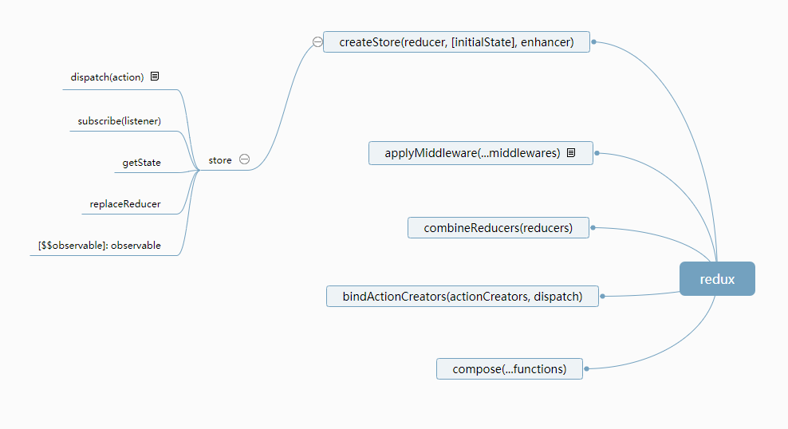

# redux 源码解读

time: 2018.8.29  
version: 4.0  
designer: heyunjiang  
update: 2018.8.29

概览：redux 是一个状态管理库，通过 `createStore(reducer, initstate, enhancer)` 构建一个 store，抽象出数据 state，要求只能通过 reducer 纯函数来更新 state，通过 store.dispatch 来调用 reducer。可以监听每次数据更新，通过 `store.subscribe` 来添加监听事件，存入事件队列中。它的中间件通过 redux.applyMiddleware 来重写 store 的 `dispatch` 方法，重新定义从 dispatch 到调用 reducer 更新 state 这个过程



目录

[1 约定](#1-约定)  
[2 基本概念](#2-基本概念)  
[3 redux 详解](#3-redux-详解)  
[4 redux 特点](#4-redux-特点)

## 1 约定

1. 应用只有一个store，当应用变大的时候，store可以拆分
2. 单向数据流：getStore()->dispatch(action)->reducer->store

问题：redux是否适用于多页应用？

答：不适用

> 关键词：store、action、reducer、middleware

## 2 基本概念

### 2.1 action

1个 action 是一个 js 对象

```javascript
{
  type: ADD_TODO,
  text: 'text'
}
```

关键词：`action`、`action创建函数`、`dispatch绑定的action创建函数`

### 2.2 reducer

唯一用于更新 state 的方式，是用创建一个新的 state 整体替换旧的 state

```javascript
import { combineReducers } from 'redux'
import * as reducers from './reducers'

const todoApp = combineReducers(reducers)
```

reducer为纯函数，接收2个参数： `state`、`action`，这里的 `action` 就是上面的action对象，表示要修改的值

```javascript
function todoApp(state = initialState, action) {
  switch (action.type) {
    case SET_VISIBILITY_FILTER:
      return Object.assign({}, state, {
        visibilityFilter: action.filter
      })
    default:
      return state
  }
}
```

可以使用 `Object.assign`，也可以使用 `...` 运算符，比如

```javascript
return {
  ...state,
  ...action.payload,
}
```

### 2.3 store

构建store: `createStore`，redux直接提供

store 5大方法

1. getState()
2. dispatch(action)
3. subscribe(listener)
4. getReducer()
5. replaceReducer(nextReducer)

> 注意: subscribe方法执行返回的结果是一个函数，这个函数是用于注销 subscribe 的

## 3 redux 详解

redux 入口暴露5个方法，可以通过 `import { createStore } from 'redux';` 方式直接引入

1. createStore(reducer, [initialState], enhancer)
2. combineReducers(reducers)
3. applyMiddleware(...middlewares)
4. bindActionCreators(actionCreators, dispatch)
5. compose(...functions)

> 注意：bindActionCreators是想对其应用的组件隐藏store和dispatch
> compose: 将包含的funcs从左到右依次嵌套执行 `funcs.reduce((a, b) => (...args) => a(b(...args)))`
> createStore 的 enhancer : 高阶函数，返回增强版 createStore

### 3.1 redux.createStore

#### 3.1.1 createStore方法参数类型和enhancer解释

```javascript
/*
 * @param {Function} reducer
 * @param {any} [preloadedState] 初始化 state，state可以是任意类型的
 * @param {Function} [enhancer] store 增强器，例如 middleware, time travel, persistence, etc.
 * @returns {Store}
 */
export default function createStore(reducer, preloadedState, enhancer) {
  if (typeof enhancer !== 'undefined') {
    if (typeof enhancer !== 'function') {
      throw new Error('Expected the enhancer to be a function.')
    }
    // enhancer 是一个高阶组件，所以传入的 middleware 一定是一个高阶组件，扩展 createStore 方法，然后传入 reducer, preloadedState
    return enhancer(createStore)(reducer, preloadedState)
  }
  let currentReducer = reducer
  let currentState = preloadedState // 创建的 state 是由用户初始化类型决定
  let currentListeners = []
  let nextListeners = currentListeners
  let isDispatching = false
}
```

#### 3.1.2 store 对象详解

```javascript
return {
    dispatch,
    subscribe,
    getState,
    replaceReducer,
    [$$observable]: observable
  }
```

看看关键的几个方法

```javascript
// dispatch
// 1. 调用 reducer 更新 state 数据，此处是同步更新数据
// 2. 触发绑定的事件
function dispatch(action) {
    // 要求 action 是纯对象
    if (!isPlainObject(action)) {
      throw new Error(
        'Actions must be plain objects. ' +
          'Use custom middleware for async actions.'
      )
    }
    // 要求 action 必须要有 type
    if (typeof action.type === 'undefined') {
      throw new Error(
        'Actions may not have an undefined "type" property. ' +
          'Have you misspelled a constant?'
      )
    }
    // 要求 dispatch 同时只能存在一个
    if (isDispatching) {
      throw new Error('Reducers may not dispatch actions.')
    }
    // 更新 state 数据
    try {
      isDispatching = true
      currentState = currentReducer(currentState, action)
    } finally {
      isDispatching = false
    }
    // 如果有绑定监听事件，则执行事件
    const listeners = (currentListeners = nextListeners)
    for (let i = 0; i < listeners.length; i++) {
      const listener = listeners[i]
      listener()
    }

    return action
  }
```

```javascript
// subscribe
// 1. 使用数组作为事件队列，分为当前执行事件队列和下个事件队列，每次新订阅的事件都加入下个事件队列，在 dispatch 更新完 store 的时候触发
// 2. 返回取消订阅该事件的方法
function subscribe(listener) {
    // 要求 listener 必须是个 function
    if (typeof listener !== 'function') {
      throw new Error('Expected the listener to be a function.')
    }

    if (isDispatching) {
      throw new Error(
        'You may not call store.subscribe() while the reducer is executing. ' +
          'If you would like to be notified after the store has been updated, subscribe from a ' +
          'component and invoke store.getState() in the callback to access the latest state. ' +
          'See https://redux.js.org/api-reference/store#subscribe(listener) for more details.'
      )
    }

    let isSubscribed = true

    ensureCanMutateNextListeners()
    // 将该事件放入下个事件循环队列中，当触发 dispatch 的时候，则循环执行这个事件队列
    nextListeners.push(listener)
    // 返回取消订阅事件方法
    return function unsubscribe() {
      if (!isSubscribed) {
        return
      }

      if (isDispatching) {
        throw new Error(
          'You may not unsubscribe from a store listener while the reducer is executing. ' +
            'See https://redux.js.org/api-reference/store#subscribe(listener) for more details.'
        )
      }

      isSubscribed = false

      ensureCanMutateNextListeners()
      const index = nextListeners.indexOf(listener)
      nextListeners.splice(index, 1)
    }
  }
```

```javascript
// observable
// 1. 观察者模式，采用 subscribe 发布事件，下轮更新时执行事件，会通过 next 方法通知观察者
function observable() {
    const outerSubscribe = subscribe
    return {
      subscribe(observer) {
        if (typeof observer !== 'object' || observer === null) {
          throw new TypeError('Expected the observer to be an object.')
        }

        function observeState() {
          if (observer.next) {
            observer.next(getState())
          }
        }

        observeState()
        const unsubscribe = outerSubscribe(observeState)
        return { unsubscribe }
      },

      [$$observable]() {
        return this
      }
    }
  }
```

`getState()` 则返回传入的 state 格式， `replaceReducer()` 用于替换reducer，不是合并，与 `combineReducers` 不同

### 3.2 redux.compose

根据依次传入的函数参数，返回依次调用函数参数的函数

```javascript
export default function compose(...funcs) {
  if (funcs.length === 0) {
    return arg => arg
  }

  if (funcs.length === 1) {
    return funcs[0]
  }

  return funcs.reduce((a, b) => (...args) => a(b(...args)))
}
```

### 3.3 redux.combineReducers

功能：合并所有的 reducer 为一个 reducer

1. 传入多个 reducer，返回一个 function，作为合并后的 reducer
2. 每次调用的时候，都会去遍历所有的 reducer
3. 返回 state

```javascript
export default function combineReducers(reducers) {
  const reducerKeys = Object.keys(reducers)
  const finalReducers = {}
  for (let i = 0; i < reducerKeys.length; i++) {
    const key = reducerKeys[i]

    if (process.env.NODE_ENV !== 'production') {
      if (typeof reducers[key] === 'undefined') {
        warning(`No reducer provided for key "${key}"`)
      }
    }

    if (typeof reducers[key] === 'function') {
      finalReducers[key] = reducers[key]
    }
  }
  const finalReducerKeys = Object.keys(finalReducers)

  let unexpectedKeyCache
  if (process.env.NODE_ENV !== 'production') {
    unexpectedKeyCache = {}
  }

  let shapeAssertionError
  try {
    assertReducerShape(finalReducers)
  } catch (e) {
    shapeAssertionError = e
  }

  return function combination(state = {}, action) {
    if (shapeAssertionError) {
      throw shapeAssertionError
    }

    if (process.env.NODE_ENV !== 'production') {
      const warningMessage = getUnexpectedStateShapeWarningMessage(
        state,
        finalReducers,
        action,
        unexpectedKeyCache
      )
      if (warningMessage) {
        warning(warningMessage)
      }
    }

    let hasChanged = false
    const nextState = {}
    for (let i = 0; i < finalReducerKeys.length; i++) {
      const key = finalReducerKeys[i]
      const reducer = finalReducers[key]
      const previousStateForKey = state[key]
      const nextStateForKey = reducer(previousStateForKey, action)
      if (typeof nextStateForKey === 'undefined') {
        const errorMessage = getUndefinedStateErrorMessage(key, action)
        throw new Error(errorMessage)
      }
      nextState[key] = nextStateForKey
      hasChanged = hasChanged || nextStateForKey !== previousStateForKey
    }
    return hasChanged ? nextState : state
  }
}
```

问题：它这里会默认遍历所以的 reducer，我通常定义的 reducer 只更新对应的 state，比如在 dva 的应用中，我通常这么调用 reducer , `yield put({ type: 'save' })`

```javascript
save (state, action) {
  return {
    ...state,
    ...action.payload,
  }
}
```

难道我所有的 reducer 都要遍历吗？

答：dva 对所有的 reducer 做了一层封装，有一个 `handleActions` 的高阶组件，当传入的 action.type 不等于 reducer 的名字的时候，就不会执行这个 reducer，当名称相等的时候，才会去执行这个 reducer.

### 3.4 redux.bindActionCreators

功能：让每个定义好的 actionCreator ，都被 dispatch 方法调用执行

注意：dispatch 方法的参数是 actionCreator 执行的结果

```javascript
function bindActionCreator(actionCreator, dispatch) {
  return function() {
    return dispatch(actionCreator.apply(this, arguments))
  }
}

export default function bindActionCreators(actionCreators, dispatch) {
  if (typeof actionCreators === 'function') {
    return bindActionCreator(actionCreators, dispatch)
  }

  if (typeof actionCreators !== 'object' || actionCreators === null) {
    throw new Error(
      `bindActionCreators expected an object or a function, instead received ${
        actionCreators === null ? 'null' : typeof actionCreators
      }. ` +
        `Did you write "import ActionCreators from" instead of "import * as ActionCreators from"?`
    )
  }

  const keys = Object.keys(actionCreators)
  const boundActionCreators = {}
  for (let i = 0; i < keys.length; i++) {
    const key = keys[i]
    const actionCreator = actionCreators[key]
    if (typeof actionCreator === 'function') {
      boundActionCreators[key] = bindActionCreator(actionCreator, dispatch)
    }
  }
  return boundActionCreators
}
```

### 3.5 redux.applyMiddleware

功能：为 store 添加中间件，覆盖重写 store 的 dispatch 方法

现在再回头去看看 dispath 实现了什么功能，与整个 store 的关系。

1. 可以看到 store 是一个对象，createStore 采用了闭包的写法，返回的 store 的众属性，拥有能够访问内部函数变量的能力，如 currentReducer、currentListeners、nextListeners、currentState、isDispatching。
2. applyMiddleware 中应用中间件有个先后顺序关系，最先传入的会依次调用后面的中间件，所以要求中间件要求能够调用其他中间件的能力。
3. 中间件是重写了 `dispatch` 这个方法，也就是控制了如何调用 reducer 更新 state 数据，redux默认的是同步更新 state；如果中间件 dispatch 的 action.type 不等于中间件指定的 type 的话，那么 dispatch 会调用 redux 默认的 dispatch 来同步更新 state。例子见下面 routerMiddleware 应用

```javascript
// applyMiddleware
import compose from './compose'

export default function applyMiddleware(...middlewares) {
  return createStore => (...args) => {
    const store = createStore(...args)
    let dispatch = () => {
      throw new Error(
        `Dispatching while constructing your middleware is not allowed. ` +
          `Other middleware would not be applied to this dispatch.`
      )
    }

    const middlewareAPI = {
      getState: store.getState,
      dispatch: (...args) => dispatch(...args)
    }
    const chain = middlewares.map(middleware => middleware(middlewareAPI))
    dispatch = compose(...chain)(store.dispatch)

    return {
      ...store,
      dispatch
    }
  }
}

```

中间件应用例子：react-router 4 的 connected-react-router 的 `routerMiddleware` 中间件

如何应用

```javascript
// routerMiddleware 源码
import { CALL_HISTORY_METHOD } from './actions'

const routerMiddleware = (history) => store => next => action => {
  if (action.type !== CALL_HISTORY_METHOD) {
    // next 表示下一个中间件在 middleware chain 中的一环，这里体现了 redux 中间件具有调用其他中间件的能力
    return next(action)
  }

  const { payload: { method, args } } = action
  history[method](...args)
}
export default routerMiddleware
```

```javascript
// 应用 routerMiddleware 例子
import { createBrowserHistory } from 'history'
import { applyMiddleware, compose, createStore } from 'redux'
import { connectRouter, routerMiddleware } from 'connected-react-router'
...
const history = createBrowserHistory()

const store = createStore(
  connectRouter(history)(rootReducer), // new root reducer with router state
  initialState,
  compose(
    applyMiddleware(
      routerMiddleware(history), // for dispatching history actions
      // ... other middlewares ...
    ),
  ),
)
```

**应用解释**:

1. routerMiddleware 首先会执行，返回函数 `store => next => action => {}` ，这个函数拥有访问 `history` 对象的能力
2. 返回的函数作为 applyMiddleware 参数传入，接受 `middlewareAPI` 作为参数传入，但是它不对 store 做任何处理，返回函数 `next => action => {}`，作为 middleware chain 的一环，这个函数拥有访问 `history、middlewareAPI` 对象的能力
3. 在 compose middleware chain 的时候，该函数会继续执行，返回函数 `action => {}` ，`next` 表示其他中间件在 middleware chain 的一环， 这个函数拥有访问 `history、middlewareAPI、next` 对象的能力
4. routerMiddleware 真正执行功能的地方，当 dispatch 的 `action.type === 'CALL_HISTORY_METHOD'` 的时候，会执行下面代码

```javascript
const { payload: { method, args } } = action;
history[method](...args)
```

## 4 redux 特点

1. 数据是通过 dispatch 方法调用 reducer 更新，更新方式为整体替换
2. 订阅事件是采用事件队列存储，在每次 dispatch 更新完数据的时候执行所有事件队列
3. 应用的中间件就是覆盖 createStore 生成的 store 对象的 dispatch 方法
4. redux.applyMiddleware 是 redux 提供的一个典型的 createStore 方法的 enhancer

## 5 问题汇总

这里记录了在使用 redux 中遇到的一系列问题

### 5.1 redux 要求的 reducer key 为什么要和 state 的 key 保持一致呢？为什么在 dva 中，我写的就没有保持一致？

保持一致：因为在 combineReducers 中，要求的就是根据 reducer 的 key 来更新对应 state 数据，是通过 key 关联的，所以 reducer key 要和对应 state 绑定起来。

dva 不一致：其实 dva 对其有做一层处理。它是通过 `namespace` 作为 reducer key，然后它的 reducers 都通过 `reducers.reduce` 依次调用了；然后 dva 再 createStore 中传入的 initState 始终是空，是通过 reducer 参数 state 的默认值 `(state = initState, action)` 方式设置的。

问：为什么通过这里传入的默认 initState 就能设置 state 的值呢？

答：在 redux 的 `createStore` 中，在返回最终创建的 store 的时候，有一句 `dispatch({ type: ActionTypes.INIT })` ，该命令就是将 reducer 的 initial state 加入到 state tree 上面

总结：不直接传入 initState ，而是通过设置 reducer state 的默认值更新 state tree 。

### 5.2 reducer 和 state 对应什么关系，如何关联的？

整体一个 state ，但是该 state 的 key 和 reducer 的 key 名称要对应起来，在 `combineReducers` 中，将所有的 reducer 合并成一个，然后执行时候传入的 state 是根据 reducer 的 key 获取对应 state 的值。所以一个 reducer 只更新它对应的 state 值

## 6 感想

redux的源码很短，就是提供的这几个api代码，直接可以方便阅读，更能理解它的api意思

对比react-redux来看，它们的源码都很简短，但是都很精炼

相比较react的源码来说，react的源码就太饶了