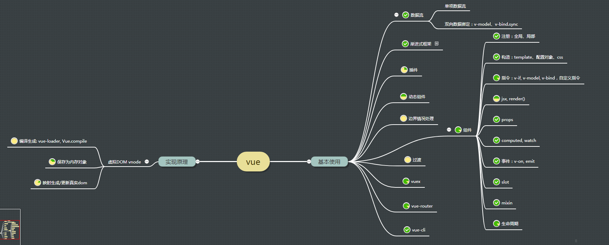

# vue 深入

time: 2019.7.4  
author: heyunjiang

[vue 基本知识](react/react-vs-vue.md) vue 基本知识使用，是总结在和 react 一起作对比



目录

[背景](#背景)  
[1 编译 compile](#1-编译-compile)
[2 虚拟 dom](#2-虚拟-dom)  
&nbsp;&nbsp;[2.1 根组件初始化](#2.1-根组件初始化)  
&nbsp;&nbsp;[2.2 组件 $mount 方法执行](#2.2-组件-$mount-方法执行)  

## 背景

到今天为止，自己使用过 react, vue, 对这2者的基本使用都是没有什么问题，特别是组件的构造，遵循了组件复用、组件低耦合、组件规范编码、高可拓展可维护性等，自己也是写代码的一把好手了。但是也只是搬砖的，只会搬砖，按照框架文档 + API，一块砖一块砖的磊起来。  

自己使用框架，常规问题是能够解决，但是如果超出一些问题边界，比如框架本身的问题，包括性能、bug等，如果不深入框架本身，那么项目出了问题还是不能及时得到解决，即使可以在 github 上提 issue，也只是解决通用的一些问题，定制性的功能不能提供。

深入学习框架，出于以下目的：  
1. 自身好奇：用了那么久的框架，对它最终渲染在浏览器上的过程都不了解，想要了解框架实现原理，vue-loader, Vue.compile 做了什么
2. 前端技能提升：vnode 在浏览器中的存储，vtree 如何更新dom，框架应用的一些关键技术点
3. 写一个微型的 vue 框架：阅读了源码，写了文章，还是容易忘，那么写一个微型 vue 加深印象吧
4. 准备 vue 3.x 源码阅读：与 2.x 做对比
5. 面向工资编程

vue 的三大核心点：编译、虚拟dom、响应式系统

阅读版本 vue 2.x

## 1 编译 compile

> 在 vue 生成虚拟节点之前，我们先来看看 vue 的模板编译，即我们写的模板是怎么转换成 vue 的 `createElement` 方法的。

从我们编写 template 到生成真实 dom，中间有一个过程，即把模板编译成 createElement 函数，这个过程叫做编译。  
虽然我们可以直接写 jsx，但是它远没有写模板来的方便，vue 为 template 提供了一些便捷写法，包括指令、特定标签等。

vue 提供了2种版本的源码

1. runtime + compiler：可以在运行时编译
2. runtime：需要通过 vue-loader 预编译，转为 createElement 函数

编译的源码路径： `import { compileToFunctions } from './compiler/index'`

## 2 虚拟 dom

> 这里包含了数据 -> vtree -> rtree 的一整个过程。

下面介绍 new Vue 之后发生的一系列过程

### 2.1 根组件初始化

```javascript
// vue 构造函数关键代码
unction Vue (options) {
  this._init(options)
}

initMixin(Vue)
stateMixin(Vue)
eventsMixin(Vue)
lifecycleMixin(Vue)
renderMixin(Vue)

export default Vue
```

在 `this._init()` 函数执行过程中，前面都是初始化我们 vue 组件中定义好的 `lifecycle`, `events`, `render`, `injections`, `state`, `provide`。在生命周期初始化之后，数据 injections 初始化之前，会触发生命周期 `beforeCreate`，在数据 provide 初始化完成之后，触发生命周期 `created`。

### 2.2 组件 $mount 方法执行

组件初始化之后，就会调用 $mount 方法，执行挂载。

## 3 响应式系统

数据驱动

## 4 其他 vue 知识细节点

1. `flow`: vue 采用 flow 做代码静态类型检查，由于 babel 和 eslint 都有相应的插件支持，改动较小
2. `function`: vue 采用 function + prototype 实现，而不是 es6 的 class 实现，为什么？

## 5 问题

### 5.1 vue 提供的预编译版本和运行时编译版本有什么不同？

答案路径: `vue/src/platforms/web/entry-runtime-with-compiler.js`

答案简述： 
1. 在运行时编译版本中，`vue.$mount()` 方法会被重写，覆盖 `core/instance/lifecycle` 目录下的 mountComponent 方法，即会在运行的时候编译一次，而预编译版本的 mount 就是使用的 mountComponent 方法，它的 template 在 webpack 打包的时候，就通过 vue-loader 编译好了，转化成对应的方法。  
2. 重写后的 $mount 方法，在内部预先调用了 `compileToFunctions` 编译了一次模板，生成了 **render** 渲染函数，当 mountComponent 调用的时候，会判断是否有 render 方法，没有才会去调用 createEmptyVNode 赋值给 render。
3. 写法不同: 预编译版本在运行时已经不包含编译需要的代码，所以不能再写运行时编译的一些风格代码，比如：`Vue.compile()`
4. 打包后体积：预编译版本体积更小，因为不再包含编译需要的代码，只包含需要运行的 vue 代码

### 5.2 当数据发生改变时，vue 是什么时机去更新虚拟树然后更新 dom 呢？

### 5.3 我们每个组件都会调用一次 new Vue 吗？

### 5.4 this.$nextTick 和 setTimeout 有什么不同？

答案路径：`vue/src/core/util/next-tick.js`

答案简述：nextTick 代码很短，下面是一些关键技术的总结

1. 闭包实现保存任务队列：将所有的回掉函数保存在一个数组中
2. 状态 pending: 用于表示上个nextTick任务是否在执行过程中，如果是则继续放入队列，待下次任务nextTick调用时执行(极端情况下会有 pending 为 true)
3. 空参数：如果 this.$nextTick 为空参数，则返回一个 promise 实例，再次执行时可以作为 microtask 运行
4. nextTick 内部采用多种情况实现：promise -> MutationObserver -> setImmediate -> setTimeout，只有当前一种情况不支持时，会降级采用后一种方法。所以在 chrome 高版本中，nextTick 可以理解为 promise 微任务的执行

> 如果不清楚 microtask, macrotask, 普通浏览器任务的执行顺序的，可以看我这篇文章 [深入浏览器-事件循环](../browser/深入浏览器-事件循环.md)

## 参考文章

[1 vue 官方文档](https://cn.vuejs.org/v2/guide/) 这次除了教程，也把 api 详细过一遍  
[2 vue 技术揭秘](https://ustbhuangyi.github.io/vue-analysis/)