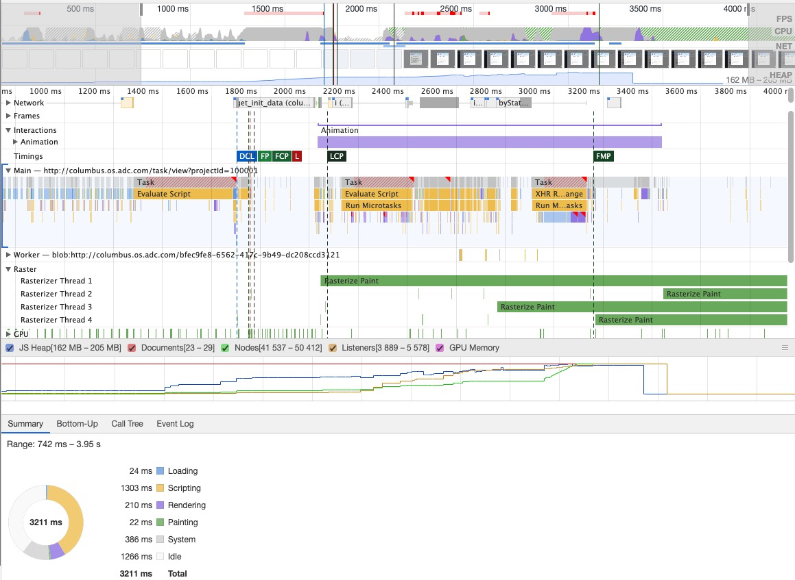

# 系统性能衡量及优化

time: 2020.6.9

目录  
- [背景](#背景)  
- [1 系统性能衡量要点](#1-系统性能衡量要点)  
- [2 性能分析](#2-性能分析)  
  - [2.1 浏览器任务管理器](#2.1-浏览器任务管理器)  
  - [2.2 影响性能因素](#2.2-影响性能因素)  
  - [2.3 chrome-dev-tool 性能分析](#2.3-chrome-dev-tool-性能分析)  
- [3 性能优化](#3-性能优化)  
  - [3.1 加载优化](#3.1-加载优化)  
  - [3.2 运行时优化](#3.2-运行时优化)  

## 背景

系统性能优化，我们需要知道系统目前的性能状态，才能知道从哪些地方发力，制定系统目标优化状态。  
那么系统性能有哪些衡量点呢？或者说用户体验有哪些要求点？

## 1 系统性能衡量要点

1. 加载：加载要求在 1s 内看到页面，fp(首次加载)
2. 响应：点击按钮在 100 ms 内响应，滚动无卡顿
3. 动画：动画 60 fps
4. 内存占用不能过高

## 2 性能分析

### 2.1 浏览器任务管理器

1. 浏览器所有进程
2. 进程占用的存储空间、cpu、网络、进程 id

### 2.2 影响性能因素

#### 2.2.1 加载时

能阻塞浏览器渲染的，目前只有 html, css, js 文件，而图片、音频、视频不会阻塞。可以结合渲染流程来看。那么图片等其他资源怎么处理呢？

1. 资源个数：每个资源一个 http 请求，浏览器对同时发起请求数量有限制
2. 资源大小：tcp 分包发送，每一个包的发送都需要时间，也就是 rtt。解析时，如果资源文件过大，解析也会耗时过长
3. 网络：如果服务器带宽、客户端网络不好，则会加大 rtt 时间

#### 2.2.2 运行时

运行时的性能问题，通常是用户操作反馈不流畅。通常原因是浏览器渲染更新频率过高、主线程执行时间过长。我们尽量减少一帧的生成时间  
重排：由 dom 结构的更改、几何位置变更触发重排，触发一次 rerender，会走 `update dom tree`、样式 `recalculate`、`layout`、`update layer tree`、`paint`  
重绘：改变元素颜色一类信息，只需要 `paint`，直接依据原有 layer tree + 新的样式 来重新绘制，不需要 update dom tree、样式 recalculate、layout、update layer tree

有如下影响渲染的因素

1. js 任务执行过长：处理大量数据，长时间处于循环中
2. 及时获取异步渲染结果：同步代码中，包含了异步渲染(更改几何高宽、颜色)，如果及时获取节点属性，则会强行在当前任务中执行渲染过程，以便同步获取渲染结果
3. js 生成动画：js 改变 dom 来实现动画，现在基本不会这么做了。css 动画可以只由合成线程来处理，脱离主线程
4. 创建过多细小对象：gc 任务阻断主线程

> 注意：连续设置 dom.style.height 不会有多个 rerender 任务，这个是多年以来的误解

### 2.3 chrome-dev-tool 性能分析

在 chrome-dev-tool 模块中，有许多子模块，比如 element, console, network, performance 等等，性能分析主要是 performance 和 memory 2者。

> 在 [chrome-dev-tool 教程](https://developers.google.com/web/tools/chrome-devtools?hl=zh-cn) 中，值得看的也是 performance 和 memory

这里主要使用 performance + memory 来执行性能分析，总结一下2者功能

[内存原理](es/深入js-内存管理与垃圾回收.md)在这里看，这里总结如何使用工具

#### 2.3.1 performance

FPS: frame per second  
HEAP: 表示 js heap 数据积累量  
Main：主要看 main 内事件任务，红色的代表有问题，需要查看调用栈，看看具体任务代码的执行时间

Timings 有几个指标

1. DCL: DomContentLoaded event, 1704.7ms
2. FP: first paint, 1751.8ms
3. FCP: first contentful paint, 页面开始绘制第一个像素点, 1751.8ms
4. L: Onload event, 1757.0 ms
5. LCP: largest contentful paint, 页面像素点绘制完毕, 2074.9ms
6. FMP: first meaningful paint, 3162.3ms

通常我们计算白屏时间，指的就是 FP 之前的时间，但是 FP 没法通过浏览器 api 获取，所以通常是用 DCL 时间来算；而首页渲染完毕时间，指的是 LCP 时间，而渲染过程时间通常是 300 ms

#### 2.3.2 memory

js heap 分析，实时内存统计

#### 2.3.3 lighthouse

加载时性能评分、性能优化建议

Speed_index：页面被明显填满的平均时间  
Time to Interactive：开始加载到可以响应用户操作的时间

## 3 性能优化

### 3.1 加载优化

1. http 缓存 `cache-control=2000`，缓存 2000s
2. 资源合并、内联
3. 资源压缩
4. cdn
5. 按需加载：首次加载首页需要的资源文件就行
6. 升级 http2，采用多路复用，解决对资源个数的限制

### 3.2 运行时优化

1. 减少 js 任务执行时间：大任务分片、work 辅助
2. 避免强制同步：保证异步渲染任务独立 (尽量减少 console.log 等方式获取节点渲染结果属性)
3. 采用 css 生成动画：可以让节点成为独立的层，比如增加 will-change、fixed、relative 等属性
4. 减少细小对象的创建

## 参考文章

[chrome performace](https://developers.google.com/web/tools/chrome-devtools/evaluate-performance)  
[Speed_index](https://developer.mozilla.org/en-US/docs/Glossary/Speed_index)
