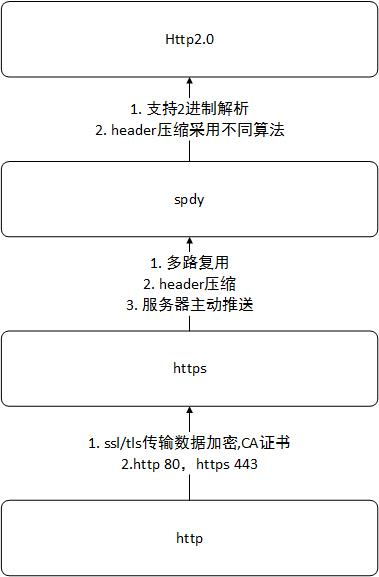

# http



目录

[1 基础知识](#1-基础知识)  
[2 http 基本优化要点](#2-http-基本优化要点)  
[3 http1.1相较与http1.0的优点](#3-http1.1相较与http1.0的优点)  
[4 https相较与http1.1的区别](#4-https相较与http1.1的区别)  
[5 将网站改造成https](#5-将网站改造成https)  
[6 SPDY](#6-SPDY)  
[7 http2相较与SPDY的区别](#7-http2相较与SPDY的区别)  
[8 有了http2，不用再做哪些优化](#8-有了http2，不用再做哪些优化)  
[9 ssl 握手](#9-ssl-握手)  
[10 tcp首部、ip首部有啥作用](#10-tcp首部、ip首部有啥作用)  
[11 慢启动](#11-慢启动)  
[12 http 缓存](#12-http-缓存)

## 1 基础知识

1. http协议建立在tcp协议之上，http协议的性能瓶颈及其性能优化都是针对tcp操作的
2. 目前在未应用https或http2之前，默认都是http1.1
3. https是运行在ssl/tls上的安全协议
4. spdy基于https，支持多路复用与header压缩，提高效率，拥有https的优点
5. http2是spdy的升级版本，支持2进制解析，拥有spdy的优点

http 请求模型

```http
# http post 请求头
POST /plmPortal/platForm/getPlatFormByEnterprise HTTP/1.1
Host: plmcloud.yonyou.com
Connection: keep-alive
Content-Length: 82
Accept: application/json, text/plain, */*
Origin: http://plmcloud.yonyou.com
User-Agent: Mozilla/5.0 (Windows NT 6.1; Win64; x64) AppleWebKit/537.36 (KHTML, like Gecko) Chrome/69.0.3497.81 Safari/537.36
Content-Type: application/json;charset=UTF-8
Referer: http://plmcloud.yonyou.com/plmPortal/dist/
Accept-Encoding: gzip, deflate
Accept-Language: zh-CN,zh;q=0.9
Cookie: JSESSIONID=43B8D7A60DFE3A8BC8EA3D28D87070A;

# http post 响应头
HTTP/1.1 200 OK
Server: Apache-Coyote/1.1
Content-Type: text/javascript;charset=UTF-8
Content-Length: 91
Date: Thu, 01 Nov 2018 10:42:09 GMT
```

常见 http 请求头字段解析

1. Host: 客户端域名
2. Connecttion：连接方式，keep-alive 表示长连接
3. Accept：希望接收到数据格式
4. Origin：源域
5. User-agent：客户端代理信息
6. Content-Type：请求数据体数据格式
7. Cookie
8. cache-control：缓存时间控制，单位 s

常见响应头字段解析

1. Server：服务器代理信息
2. Content-type：服务器返回数据类型，可以是 json, html, stream 等
3. Date：日期
4. Connection：连接方式， keep-alive 表示长连接
5. Last-modify：上次更新日期，通常用于静态资源文件
6. Etag
7. Cache-control：缓存时间控制，单位 s。no-cache 表示协商缓存，携带 Etag 发起验证请求；no-store 表示没有缓存；max-age 设置有效期；public 中间人可以缓存
8. Set-cookie

[cache 原理](https://developer.mozilla.org/zh-CN/docs/Web/HTTP/Caching)

### 1.1 内容协商

内容协商，指客户端和服务端协商资源表示形态，比如通过 `accept-encoding: gzip` 表示期望经过 gzip 压缩。通常包含如下信息  
1. accept-encoding
2. accept-language

### 1.2 定长包体

定长包体：如果 content-length 指定，那么接收端就会严格按照该参数来处理，如果实际数据 length 大于 content-length，那么接收方只会接收到指定长度的数据；如果实际数据 length 小于 content-length，那么接收方接收不到任何数据；
不定长包体：如果 http header 包含了 `Transfer-Encoding: Chunk`，那么 content-length 就会失效

### 1.3 分片下载

通过 http header Range 字段，指定接收的二进制数据长度，比如 `curl http://www.xxx.xxx?hello.txt -H 'Range: byte=10-14'` 表示获取 txt 文件的第11-15个字符。
1. 服务器会为这整个下载流程生成一个 `ETag` 指纹
2. response http code: 206 partial content
3. response Content-Range: bytes 123-129/129
4. request Range: bytes=123-。如果服务器不支持 Range header，那么会返回 200 全部的内容
5. 如果请求多段 Range:bytes=1-5,7-9，那么服务器会返回 `Content-Type: multipart/byteranges;boundary`

### 1.4 条件请求

响应头部  
1. Etag: W"xsdfsa"，W 表示 weak 弱验证器，不要 W 表示强验证器
2. Last-Modify: Http Date ，表示资源上次修改时间

请求头部  
1. If-Match: Etag
2. If-None-Match: Etag
3. If-Modify-Since: Http Date
4. If-Unmodify-Since: Http Date
5. If-Range: Etag/Http Date

应用场景  
1. 缓存更新，在缓存过期之后，可以通过 Etag or Http Date 去验证缓存是否失效。304 表示 not-modify，可以继续使用缓存，那后续还会验证是否失效吗？200 表示缓存更新
2. 增量更新，在分片下载和暂停下载时，可以使用 `If-Unmodify-Since` 或 `If-Match` 判断是否有更新。412 表示验证失败，需要重新获取所有数据
3. 更新丢失问题，在共同更新资源时，可以使用乐观锁保证第一个更新成功，后续的更新必须把第一次的更新获取到本地再更新。使用 `If-None-Match: Etag` 条件请求头来判断是否有更新

## 2 http 基本优化要点

### 2.1 带宽

目前网络基础建设得到很大提升，带宽不是影响的主要因素

### 2.2 延迟

1. 浏览器阻塞(对于同一域名，一般只有仅限的几个连接，超过被阻塞)
2. dns查询：浏览器获取目标服务器的Ip地址
3. 建立连接：每次连接都经历3次握手和慢启动

### 2.3 数据明文传输

改为加密传输

### 2.4 tcp3次握手

每次传输数据时，都需要重新建立连接，增加了大量的延迟时间。为什么需要三次握手？

> 怎么解决？  
> 保持长链接

### 2.5 header携带的内容过大

每次传输，header的内容都几乎不怎么变化，浪费空间

> 怎么解决？  
> 长链接、压缩

### 2.6 `connection: keep-alive` 使用过多

使用过多会对服务器造成过大的压力

> 怎么解决？  
> 只使用一个长链接，复用

## 3 http1.1相较与http1.0的优点

1. 缓存机制更多：增加更多的缓存策略
2. 带宽优化：支持请求部分资源，而不是整个对象(206 partial content)
3. 错误状态码增多：409表示请求的资源与资源的当前状态发生冲突，410表示服务器的资源被永久性删除
4. 增加host：服务器可以配置多个虚拟主机
5. 保持长连接：`connection: keep-alive`，减少tcp每次的连接(连续请求)

## 4 https相较与http1.1的区别

1. https需要ca安全证书
2. 端口不同： http 80，https 443
3. https传输内容加密
4. https有效防止运营商劫持
5. 对服务器压力更大：密钥计算，消耗cpu资源

## 5 将网站改造成https

1. 购买并安装CA证书
2. https存在ssl握手过程，不优化会存在速度降低

## 6 SPDY

1. 多路复用：降低延迟，对于每一个连接，都可以重复使用，发送多条消息
2. header压缩
3. 基于https协议加密
4. 主动推送：同名称静态文件单个请求，多个推送

> 注意：高版本的chrome对spdy已经不支持

## 7 http2相较与SPDY的区别

1. http2是spdy的升级版本
2. http2支持http、https传输，spdy强制https
3. header压缩算法不同，http2 HPACK，SPDY DEFLATE

http2 相较于 http1 只是在 http1 的基础上扩展了一些功能，还是采用的 tcp 作为传输层的控制协议，最大特点是安全链接、多路复用、header压缩、长链接

## 8 有了http2，不用再做哪些优化

1. HTTP2对数据进行二进制分帧，
2. 在http和tls之间增加的一层分帧层
3. 每个分片包含分片信息和header压缩信息
4. 通过一个tcp连接，无序地传输分片，然后再在接收端组装
5. 而不必考虑代码合并或者sprite图优化了(所有需要的资源一次性地给你，然后分片无序传输给你)
6. 这个唯一的tcp连接是一个双工字节流连接，服务器主动推送资源
7. 分片之间存在优先级，解决了资源阻塞问题

## 9 ssl 握手

[ssl运行机制](http://www.ruanyifeng.com/blog/2014/02/ssl_tls.html)

应用的是非对称加密(公钥私钥)与对称加密

1. 基本消息对称加密，提升非对称加密速度
2. 公钥对已经加密过的消息(对称加密)进行加密，私钥解密
3. 公钥放在证书中，共享出去，私钥只解密含有证书的公钥机密消息

握手阶段：在tcp3次握手之前，会有ssl四次握手

1. 客户端->服务端：`clientHello`、`可用的tls版本`、`可用的加密算法集合`、`可用的压缩算法`、`第一个随机数`
2. 服务端->客户端：`serverHello`、`采用的tls版本`、`采用的加密算法`、`采用的压缩算法`、`ca证书，含公钥`、`第二个随机数`
3. 客户端->服务端: `确认加密结束`、`第三个随机数`、`ack`
4. 服务端->客户端：`确认加密`、`ack`

> 相比与 tcp 的3次握手， tls 的4次握手，就是多了 `tls版本`、`加密算法`、`压缩算法`、`ca证书及公钥`、`随机数`，每次会话都需要进行 tls 4次握手，所以 http2 采用了长链接
> 随机数作用：公钥只是用来加密，非对称加密；随机数用于每次会话生成对称加密；第三个随机数会用第二次握手服务器提供的公钥进行加密

**工作过程**：4次握手结束之后，然后就普通 http 通信了，不过数据都才用会话密钥进行加密传输。这里的会话密钥就是通过那3个随机数、采用的加密算法生成的。比如 RSA密钥交换算法 + 3个随机数 = 特定对称密钥  
**公钥作用**：服务器提供的公钥，用于第三个随机数加密  
**私钥作用**：服务器解密第三个随机数  
**对称密钥作用**：握手之后的 http 通信数据加密

## 10 tcp首部、ip首部有啥作用

从 http 到 tcp，再从 tcp 到 ip，每次都会包裹一层对应的首部，那么这个首部有啥作用？

1. tcp 首部包含了源端口、目的端口、序号、确认号、窗口值等
2. ip 首部包含了版本号、首部长度、数据总长度、ip分片标示号、可经过的路由器数(ttl)、源 ip、目的 ip

## 11 慢启动

关键词： `超时重传`、`tcp窗口`、`接收承受最大窗口`、`发送拥塞窗口`

1. 通信开始时，发送方的拥塞窗口大小为 1。每收到一个 ACK 确认后，拥塞窗口翻倍。
2. 由于指数级增长非常快，很快地，就会出现确认包超时。
3. 此时设置一个“慢启动阈值”，它的值是当前拥塞窗口大小的一半。
4. 同时将拥塞窗口大小设置为 1，重新进入慢启动过程。
5. 由于现在“慢启动阈值”已经存在，当拥塞窗口大小达到阈值时，不再翻倍，而是线性增加。
6. 随着窗口大小不断增加，可能收到三次重复确认应答，进入“快速重发”阶段。
7. 这时候，TCP 将“慢启动阈值”设置为当前拥塞窗口大小的一半，再将拥塞窗口大小设置成阈值大小（也有说加 3）。
8. 拥塞窗口又会线性增加，直至下一次出现三次重复确认应答或超时。

[慢启动及原理传输](http://blog.csdn.net/book_zhouqingjun216/article/details/51812786)

## 12 http 缓存

time: 2021-04-21 14:33:48  
参考文章 [mdn http cache](https://developer.mozilla.org/zh-CN/docs/Web/HTTP/Caching)

缓存分类  
1. 私有缓存：即用户浏览器缓存，通过 http get 下载的资源，提供给用户浏览器前进后退、离线查看、减少多余请求等
2. 共享缓存：即 isp 或公司环境代理，保存在中间服务器上的缓存资源

### 12.1 http cache-control 控制缓存

1. no-store：不要缓存
2. no-cache：协商缓存，每次会发请求到服务器(发的什么请求，options 吗？)，携带缓存时间验证参数，未过期则返回 304，使用本地缓存
3. public：共享缓存，可以被中间人缓存
4. private：只能被浏览器缓存
5. max-age=31536000：强缓存，距离请求开始的缓存时间秒数，存储在 memory or disk
6. must-revalidate：缓存校验，每次使用时，都需要去校验是否有效

cache-control: no-cache 位于  
1. response: 表示资源走协商缓存
2. request: 表示资源不会默认走本地缓存，都会向服务器发起请求(这个不对，因为在有的 js 请求也带上了 no-cache，但是还是从 memory 中读的数据)。如果服务器强行返回 304，则还是会取缓存？待验证

chrome 勾选 disable-cache 就会在 http request header 加上 `cache-control: no-cache` 字段，并且强行向服务器发起请求，不会主动走缓存(说明勾选 disable-cache 不是只修改了 http request header)

问题：  
1. 304 是从哪里读取的缓存？memory or disk?
2. 存储在 memory or disk，是有何根据？
3. no-cache, max-age, expires, last-modified 优先级？

[从浏览器的Disable cache谈起](https://juejin.cn/post/6844904145057480718)

### 12.2 缓存过期

我们设置的 max-age 时间到期后，缓存就属于过期缓存。过期处理：  
1. 浏览器命中缓存，会发起请求携带 `if-none-match` 或 `if-modified-since` +  `Etag` (如果请求资源 response 返回了 Etag，后续 request 验证缓存过期会带上) 到服务器监测资源是否有更新
2. 没有更新服务器返回 304
3. 如果服务器验证 `if-none-match` 或 `if-modified-since` 已过期，则会返回最新资源，客户端再次根据 cache-control 来更新缓存，把之前旧的缓存删除

除了 cache-control，也有通过 Expires, Date, Last-Modified 来计算缓存时间
1. 如果没有 max-age，但是有 Expires + Date，则 Expires > Date 则表示缓存有效
2. 如果没有 max-age + Expires，但是有 Last-Modified，则缓存计算规则为 (Date - Last-Modified) / 10

问题：如果还在缓存有效期内，如何强更新呢？  
答：设置 must-revalidate；点击浏览器刷新按钮；浏览器偏好设置里设置Advanced->Cache为强制验证缓存；vary 校验

vary 校验缓存使用规则：请求服务器最新资源时，服务器除了返回 cache-control 外，还返回了 `vary: Etag` 字段；在通过 cache-control 添加了资源缓存后，后续资源请求需要携带缓存资源 vary 要求的 http header 字段及值，匹配上才可以使用缓存  
思考：我们通过 vary 设置了缓存之后，后续可以通过提前发起请求获取 vary 要求的字段值，服务器控制使用需要命中缓存

## 参考文章

[混合内容升级 https](https://juejin.cn/post/6844904101826789389)
