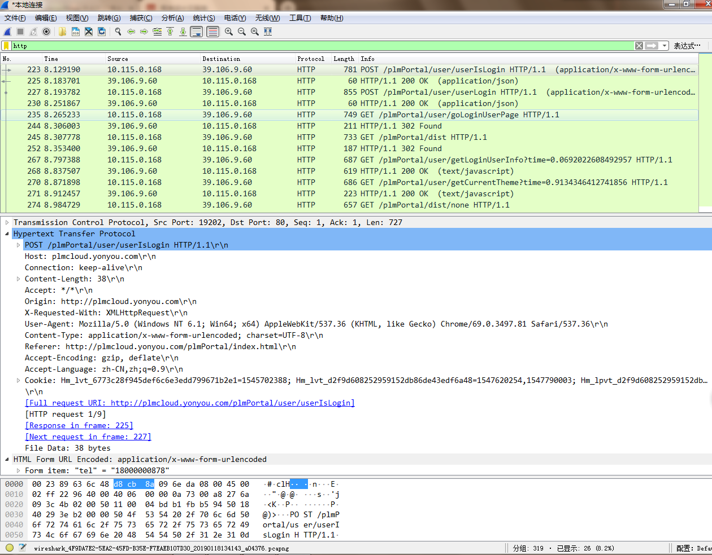

# 网络-抓包

time: 2019.01.18  
update: 2021-12-28 10:27:42

这里总结一下 wireshark 抓包学习总结

## 1 基本功能

1. 开始/停止 录制
2. 协议过滤
3. 详细协议分析

> 说明：wireshark 能捕捉到各种协议，比如 http, http2, tcp, ip, arp, smtp 等，是学习协议分析的好地方

## 2 配置 https/http2 抓包

wireshark 能直接解析 http 普通报文，但是对于 tls 加密的，如果不知道密钥(公钥or私钥?)，则无法解析响应 tls 加密结果。  
通常我们结合 chrome 实现浏览器网络报文解析，步骤如下  
1. 配置 `SSLKEYLOGFILE` 环境变量，mac 直接 `vim ~/.bash_profile`，设置 `SSLKEYLOGFILE="/Users/xxx/tls/keylogfile.log"`
2. 去对应 tls 目录，添加 keylogfile.log 文件，此刻文件内容为空
3. 使用命令行工具打开 chrome，`open https://v.qq.com`，这里目标地址换成我们想抓包的地址即可。为什么使用命令行工具打开，因为我测试直接点击 chrome 图标打开是抓不到 http2 报文
4. keylogfile.log 已经被填入了内容
5. 打开 wireshark，点击 Capture -> 配置 host 为目标网址，即可抓去 http2 报文

## 参考文章

